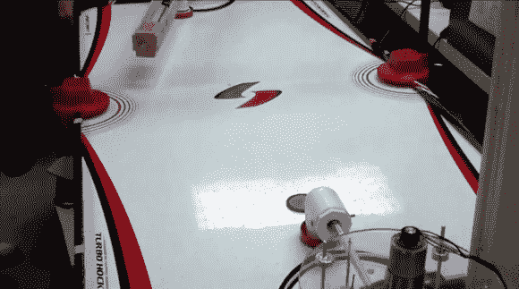

# 机器人空气曲棍球锦标赛作为最终项目

> 原文：<https://hackaday.com/2013/05/18/robot-air-hockey-championship-as-a-final-project/>

我的最终项目是制造一个会打空气曲棍球的机器人？我在哪里报名？显然你在克莱姆森大学获得了 ECE496 的一个席位。他们已经将这个概念作为最终项目使用了至少几年。[Abe Froman]是今年获胜的设计团队成员之一，他正在展示他的机器人和一些获胜的游戏。

他的机器人在前景中。它使用一个直角 PVC 接头来固定桨。该配件连接到一个齿条和小齿轮，驱动它向前和向后。整个组件安装在旋转设备上。看看它的一些对手使用更多的绘图仪类型的手臂。这些产品在关节处有太多的间隙，有时会导致产品丢失。

一旦你找到工作，很有可能你不会被要求为公司做事，除非他们是赚钱的人。当然，也有一些明显的例外，但是既然你是玩着去上学的，我们真的很感谢教授们在你变得严肃之前让学习变得尽可能愉快(甚至可能打领带！).

[https://www.youtube.com/embed/owaa1wVa_eY?version=3&rel=1&showsearch=0&showinfo=1&iv_load_policy=1&fs=1&hl=en-US&autohide=2&wmode=transparent](https://www.youtube.com/embed/owaa1wVa_eY?version=3&rel=1&showsearch=0&showinfo=1&iv_load_policy=1&fs=1&hl=en-US&autohide=2&wmode=transparent)

[via [Reddit](http://www.reddit.com/r/ECE/comments/1ef3hp/my_senior_design_an_autonomous_air_hockey_robot/)