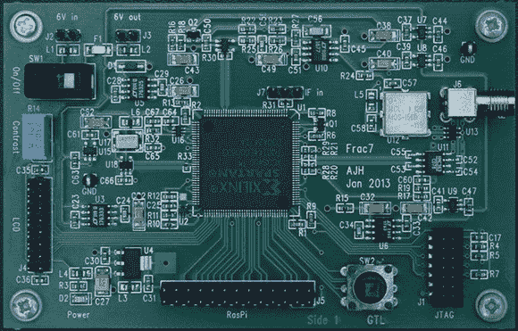

# 自制 GPS 获得 1 米分辨率与树莓 Pi

> 原文：<https://hackaday.com/2013/05/17/homebrew-gps-gets-%c2%b11-meter-resolution-with-a-raspberry-pi/>

我们已经关注了安德鲁·霍尔姆和他自制的 GPS 接收器一段时间了。几年前，[Andrew] [从零开始建造了一个四通道 GPS 接收器](http://hackaday.com/2011/10/01/make-your-own-gps-receiver/)，但显然这对他来说还不够。他[去年扩大了他的构建](http://hackaday.com/2012/12/24/update-roll-your-own-gps-can-now-track-twice-as-many-satellites/)以跟踪多达 8 颗卫星，本月[为 12 通道电池供电自制 GPS 接收器增加了树莓 Pi](http://www.holmea.demon.co.uk/GPS/Main.htm#) ，其精度约为 3 英尺。

Raspi 连接到处理本地振荡器、实时事件和自动跟踪卫星的 FPGA 板上。Pi 通过 SPI 接口处理复杂但时间要求不高的数学运算。由于 Pi 通过 SPI 接口与 FPGA 相连，因此它还可以加载更多自定义代码，从而有可能将 12 通道接收器变成 16 或 18 通道接收器。

附在 FPGA 板上的 LCD 显示器显示当前的纬度、经度和其他各种数据，如接收到的卫星数量。采用大容量锂离子电池，整个系统可供电 5 小时左右；一个令人印象深刻的便携式 GPS 系统，可以与最好的商业选择相媲美。