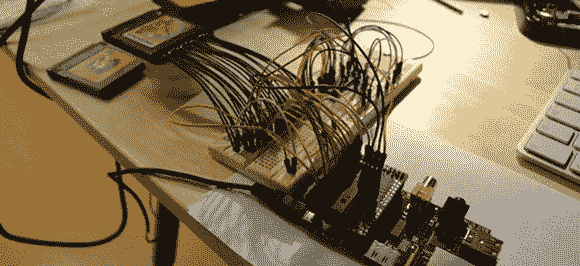

# 和 I2C 一起看游戏推车

> 原文：<https://hackaday.com/2013/05/17/reading-game-boy-carts-with-i2c/>

第一次看到一个 Game Boy 模拟器后，[Thijs]惊叹不已。一个只有几个电子设备的小盒子把一个 Game Boy 卡盒变成了一个可以在模拟器上运行的文件，简直太神奇了。[Thijs]已经了解了很多关于英国和 GBC 墨盒的知识，但仍然认为真正学到东西的唯一方法是卷起袖子，把手弄脏。由此诞生了[【Thijs】“Game Boy 弹壳倾倒器](https://blog.thijsalkema.de/blog/2013/05/14/game-boy-cartridge-dumping-on-a-raspberry-pi-part-1/)，由一对 I2C 端口扩展器和一个树莓 Pi 驱动。

受在树莓 Pi 的帮助下从超级任天堂游戏中转储 rom 的启发，[Thijs]获取了创建自己的 GB cart dumper 所需的所有硬件。一个 [DS Lite 盒式适配器](https://dx.com/p/repair-parts-replacement-gba-game-cart-slot-for-nds-lite-37787)提供物理连接，一对 MCP23017 I/O 扩展器——其中一个焊接到 PI/O 板的[片——提供电气连接。](https://www.modmypi.com/slice-of-pio-raspberry-pi-breakout-boad)

最终，[Thijs]设法在大约 13 分钟内从日本版的口袋妖怪黄色和金色中卸载了 rom。这是一个更慢的传输速率，每辆 SNES 车 26 分钟[，在帖子中给了【Thijs】这个版本的灵感](http://hackaday.com/2013/01/04/turning-a-raspberry-pi-into-an-snes/)。尽管如此，[Thijs]可能会是第一个说他从这个构建中学到了很多东西，特别是在从弹夹中倾倒正确的银行的一些问题之后。