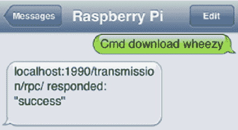

# 用谷歌语音控制终端

> 原文：<https://hackaday.com/2013/05/19/controlling-a-terminal-with-google-voice/>

对于谷歌语音有多棒，我们很惊讶我们以前没见过这个。[史蒂夫] [正在使用谷歌语音](http://stevenhickson.blogspot.com/2013/03/controlling-raspberry-pi-via-text.html)在几乎任何一台 Linux 机器上运行命令。

谷歌语音没有官方 API，现有的非官方 API 也达不到[史蒂夫]项目的标准。他最后写了自己的程序，每分钟检查一次未读邮件收件箱，寻找以“Cmd”开头的新短信。如果一系列检查通过(文本来自一个已知的电话号码和一个正确的终端命令),该命令将运行并发回一个指示成功或失败的文本。

虽然[史蒂夫]可能不会很快通过短信玩 nethack 或 Zork，但我们可以看到这对 Raspi 家庭自动化任务非常有用。只需发送一条短信，一个适当配置的 Linux 盒子就能打开你的车库门，打开灯，甚至启动一个网络摄像头。