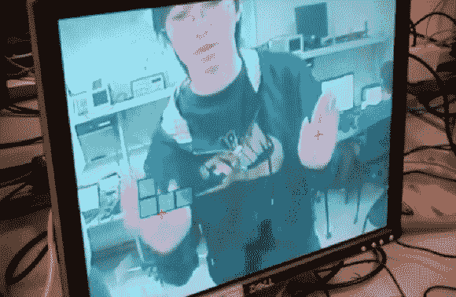

# 反俄罗斯方块项目是一个研究手部跟踪的项目

> 原文：<https://hackaday.com/2013/05/22/anti-tetris-project-is-a-study-in-hand-tracking/>

反俄罗斯方块游戏的玩法是站在显示器前，看着落下的俄罗斯方块碎片覆盖在你身体的视频图像上。每只手用来使棋子消失，这样它们就不会堆积到屏幕的顶部。我们不认为这是下一个大的独立游戏。我们看到的是一些非常有趣的手部追踪技术。

FPGA 驱动游戏，使用摄像头作为输入。为了跟踪你的手，康奈尔大学的学生们发现 YUV 图像显示了特定范围的肤色，可以将其编码为过滤器，以指导光标的放置。但是他们需要一点技巧来获得这些价值。他们在 YUV 转换为 NTSC 输出的 RGB 之前接入了摄像机电路。

记录手垂直于屏幕的运动也是他们面临的一个挑战。因为手的位置已经确定，所以他们能够测量上下边界之间的距离。如果该距离变化足够快，它将被视为一个输入，使当前块消失。

 [https://www.youtube.com/embed/NE5GdK3eW8w?version=3&rel=1&showsearch=0&showinfo=1&iv_load_policy=1&fs=1&hl=en-US&autohide=2&wmode=transparent](https://www.youtube.com/embed/NE5GdK3eW8w?version=3&rel=1&showsearch=0&showinfo=1&iv_load_policy=1&fs=1&hl=en-US&autohide=2&wmode=transparent)