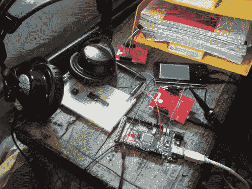

# 把你的耳朵当作示波器

> 原文：<https://hackaday.com/2013/05/25/use-your-ears-as-an-oscilloscope/>

在研究发动机控制电路时，[Scott]发现自己需要一种方法来同时比较两个控制电路的性能。他拥有的业余爱好质量示波器不能胜任这项任务。想了一会儿之后，他最终把自己的耳朵当成了示波器。

他测量的信号非常适合这个挑战，因为它们在人类的听觉范围内。他用一些电线缠绕在耳机插孔上的三根导线上，以便将它们连接到试验板。然后，他简单地将每个通道连接到一个电机驱动电路，并连接公共接地。听着每只耳朵里音高的[音准](http://en.wikipedia.org/wiki/Intonation_(music))，他真的能够调整它们。

如果他一直在寻找一个特定的频率，他可以[用他的声卡采集并分析一个样本](http://hackaday.com/2012/07/02/decoding-rf-link-using-a-pc-soundcard/)。但是平衡是他在这里需要的，你必须承认这是一个简单而聪明的方法。