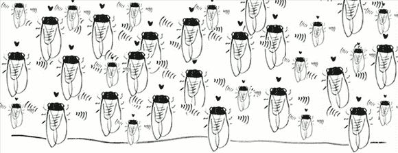

# 用无线电实验室和 Arduino 追踪蝉

> 原文：<https://hackaday.com/2013/05/23/tracking-cicadas-with-radiolab-and-an-arduino/>

每隔 17 年，从康涅狄格州到北卡罗来纳州的阿巴拉契亚高地，都会出现一群蝉来骚扰听力范围内的所有人。东海岸上一次看到这种雏鸟是在 1996 年，这使得 2013 年又是令人讨厌的虫害年。唯一的问题是，我们什么时候开始看到今年的蝉孵出来了？

Radiolab 是一个很棒的播客和公共广播节目，它整合了一个很棒的项目，要求听众[跟踪他们所在地区的蝉何时出现](http://project.wnyc.org/cicadas/#buildyourown)。当地表下 8 英寸的地面温度达到 64 华氏度时，蝉通常会进入它们喧闹而令人讨厌的成年阶段。配备 Arduino、热敏电阻以及一些电线和电阻，任何无线电实验室收听者都可以将土壤温度数据上传到无线电实验室服务器，所有数据都将与记录的蝉目击事件相关联。

按照页面上的说明将一束 led 和一个热敏电阻连接到 Arduino 后，只需上传[我们见过的评论最多的代码](https://raw.github.com/wnyc/sensors/master/arduino/temperature/temperature.ino)，然后出去进行土壤温度测量。温度以伪二进制格式显示在九个发光二极管上。为了解码温度而不用 2 的幂计数，Radiolab 有一个在线解码器，它还允许你上传数据和位置。