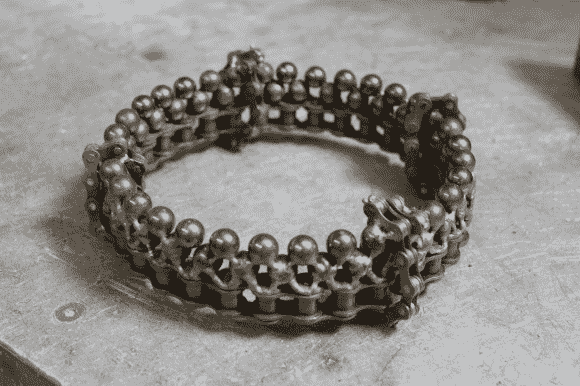

# 皇冠为你赢得了垃圾场之王的称号

> 原文：<https://hackaday.com/2013/05/26/crown-earns-you-the-title-king-of-the-junkyard/>

[Greg Shikhman]想在毕业前再用一次学校的工具。在走访了镇上一些当地的摩托车商店购买零件后，他为自己打造了这个皇冠。

他没有支付[铁价](http://gameofthrones.wikia.com/wiki/Iron_price)，因为摩托车滚子链反正是废料。链条确实会磨损，这些都是更换新链条后剩下的。他首先用一点 WD-40 溶剂、二甲苯和肥皂水来清除污垢。还有一层黑色的氧化物，通常可以防止它们生锈，他把它浸在盐酸里剥掉。

链条是灵活的，这会使皇冠看起来凌乱不堪。修复工作包括在他进行 TIG 焊接时，使用一个他头部大小的铝模板来保持皇冠的圆形。双排抛光钢珠轴承取代了珠宝。好像十磅重的东西还不够痛似的，他又加了四圈自行车链条作为强调，他承认这使得这个东西不适合穿，因为它们扎进了他的脑袋。我们仍然不认为这是一个足够好的借口来发布关于这个项目的文章，也不要包括一张他在垃圾场加冕时穿着这件衣服的照片。

这将是一个有趣的后续国王戒指与[相似的 LED 功能的订婚戒指](http://hackaday.com/2013/05/20/adding-leds-to-an-engagement-ring/)但使用这种重金属设计风格。