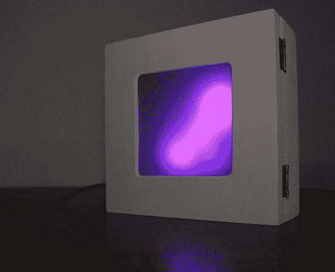

# Arduino 粒子灯箱从声音生成动画

> 原文：<https://hackaday.com/2013/05/28/arduino-particle-light-box-generates-animations-from-sound/>

简单的工具用得好可以产生奇妙的结果。[吉拉德]在这个项目中使用的硬件是 common 的定义。我们敢打赌，你现在手头上有大部分(如果不是全部的话)。但最终产品是一个灯箱，它似乎会随着房间里的每一个声音而跳舞和旋转。在阅读材料清单之前，您应该先观看演示视频，这样简单性就不会破坏它。

一个木制工艺盒作为外壳。里面有一个 Arduino 板、麦克风和一个 8×8 RGB 模块。投影箱的前盖使用一张描图纸在泡沫板框架上漫射光线。是代码把所有东西集合在一起。他自己编写了[粒子系统库](https://github.com/giladaya/arduino-particle-sys)来生成有趣的动画。

如果你手头没有项目箱，这个[可以和超深相框](http://hackaday.com/2013/02/21/framing-up-your-electronics-projects/)一起使用。

[https://www.youtube.com/embed/EmoLWKVwxck?version=3&rel=1&showsearch=0&showinfo=1&iv_load_policy=1&fs=1&hl=en-US&autohide=2&wmode=transparent](https://www.youtube.com/embed/EmoLWKVwxck?version=3&rel=1&showsearch=0&showinfo=1&iv_load_policy=1&fs=1&hl=en-US&autohide=2&wmode=transparent)