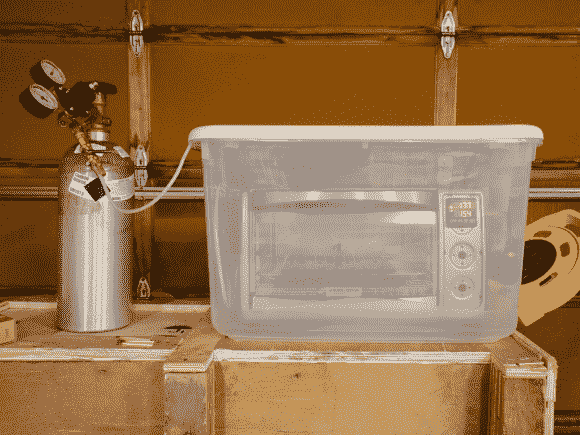

# 用二氧化碳改善回流焊接

> 原文：<https://hackaday.com/2013/05/29/reflow-soldering-improved-with-carbon-dioxide/>

这就是它看起来的样子。[Oleg]称之为惰性气体中的焊接，但它只是一个放入充满二氧化碳的容器中的烤箱回流黑客。

为什么要这么麻烦呢？都是关于焊料润湿的。这是熔化的焊膏流入电路板所有镀锡区域的能力。【Oleg】讲热风整平 PCB 镀锡的保质期，大概是六个月。此后，锡被氧化。它肯定不会像裸铜那样糟糕，但如果你的 PCB 离开生产线超过 6 个月，它会导致糟糕的焊点。这是使用助焊剂的原因之一。酸会侵蚀氧化层，露出锡，锡会有更好的润湿性。

但是还有另一种方法。无氧焊接也有助于润湿过程。二氧化碳比空气重，所以把回流焊炉放在一个塑料容器里可以让你清除空间里的空气。二氧化碳罐既便宜又容易获得。如果你自己酿造啤酒，你已经拥有一瓶了！

如果你除了回流焊炉什么都有了，那就四处看看[几个如何打造自己的](http://hackaday.com/2012/03/08/toaster-oven-reflow-soldering-roundup/)的例子。