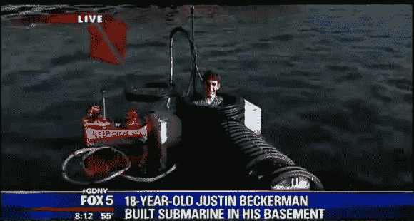

# 18 岁建造功能潜艇

> 原文：<https://hackaday.com/2013/05/30/18-year-old-builds-functioning-submarine/>

贾斯汀·贝克曼建造了一艘单人潜艇。问题是，这不是他造的第一个。通过查看他网站上的项目，我们发现几乎没有关于这个版本的信息，但他确实展示了一个以前的模型，以及几个无人水下漫游器项目。

潜艇的耐压壳是由波纹排水管制成的。这不是一个坏主意，因为管道被设计成埋在地下，并在其上承载泥土的负荷。它的设计深度只有 30 英尺，这解释了为什么两端都没有半穹顶；在那个深度压力并不是很大。漂浮在他左边的浮标是他浮出水面的绳索。新鲜空气从这里被泵入潜艇。他还包括安全功能，如 20 分钟的空气罐，以防他陷入困境，以及快速打开顶部舱口。那个舱口是一个透明丙烯酸的半球，让他可以看到他周围的东西。

你可以从他发布的两段视频中了解更多信息。福克斯 5 新闻采访包括一张我们见过的最乱的工作台的照片。乱七八糟的板凳是工程建设不断的标志吧？

[https://www.youtube.com/embed/7zgb-Z8LLU4?version=3&rel=1&showsearch=0&showinfo=1&iv_load_policy=1&fs=1&hl=en-US&autohide=2&wmode=transparent](https://www.youtube.com/embed/7zgb-Z8LLU4?version=3&rel=1&showsearch=0&showinfo=1&iv_load_policy=1&fs=1&hl=en-US&autohide=2&wmode=transparent)

[https://www.youtube.com/embed/GXHvFPktF_M?version=3&rel=1&showsearch=0&showinfo=1&iv_load_policy=1&fs=1&hl=en-US&autohide=2&wmode=transparent](https://www.youtube.com/embed/GXHvFPktF_M?version=3&rel=1&showsearch=0&showinfo=1&iv_load_policy=1&fs=1&hl=en-US&autohide=2&wmode=transparent)

[通过 [Technabob](http://technabob.com/blog/2013/05/25/kid-builds-own-submarine/) 感谢 Greg