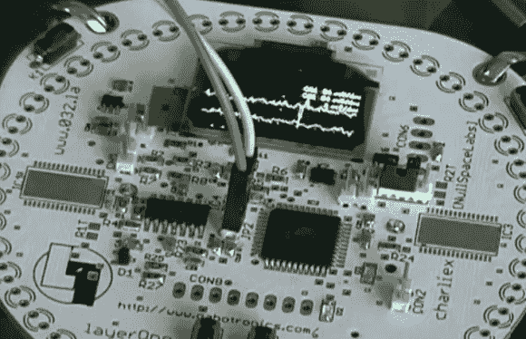

# 2013 年 LayerOne 徽章黑客大赛冠军

> 原文：<https://hackaday.com/2013/06/01/2013-layerone-badge-hacking-contest-winner/>

[Dynotronix]来信分享了他赢得 2013 年 LayerOne 徽章黑客大赛的消息。除了这个好消息，他还附上了对他的徽章破解的描述。

几天前，我们仔细查看了徽章上的硬件。您可能还记得，它的周边配备了 48 个 led，由两个 IC 驱动。看着上面的图片，很难忽略一个事实，那就是[Dyno]没有填充任何内容。他直接使用 XMEGA 处理器来分析和生成信号。

但是你能用这个东西产生的信号做什么呢？原来一个相当简单的电路就可以做成一个发射器。[Dyno]承认这是一个非常挑剔的设置，但仅仅是一小片覆铜上的几个组件就把它变成了一个调频发射机。看看这段视频，你可以听到通过他的压控振荡器电路(范围约为 15 英尺)将扫描警报类型的声音推送到 FM 收音机。

[https://www.youtube.com/embed/tit7J2onqOM?version=3&rel=1&showsearch=0&showinfo=1&iv_load_policy=1&fs=1&hl=en-US&autohide=2&wmode=transparent](https://www.youtube.com/embed/tit7J2onqOM?version=3&rel=1&showsearch=0&showinfo=1&iv_load_policy=1&fs=1&hl=en-US&autohide=2&wmode=transparent)