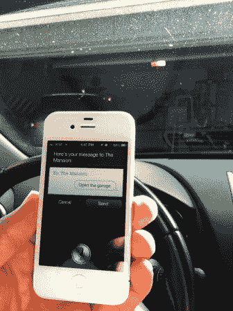

# 复杂的 IPhone 车库门开启器

> 原文：<https://hackaday.com/2013/06/01/complicated-iphone-garage-door-opener/>

这台 iPhone 车库门开启器的组装方式有点像鲁比·戈德堡。但它确实完成了任务，所以我们有什么资格去评判呢？此外，你必须考虑到苹果产品不像安卓手机那样对黑客友好——所以这可能是最简单的非越狱方式。

它的主要组件是 iPhone，一个 Wemo WiFi 插座和一个额定 110V 的机械继电器。但是等等，肯定不会这么简单吧？你是对的，只是因为加入了托词[高杯饮料]。

你可能记得听说过从[开始的警示管项目](http://hackaday.com/2013/05/25/alert-tube-monitors-all-aspects-of-your-digital-life/)。这是一个基于网络的自然语言脚本服务。把所有东西放在一起，它是这样工作的:iPhone 发送一条文本信息，IFTTT 将它转换成 Wemo 命令。电源线将 Wemo 插座连接到继电器上的 110V 电极。继电器的常开连接与操作车库门遥控接收器的按钮连接在同一螺丝端子上。当继电器关闭时，车库门上升或下降。

我们遇到的最大问题是无法知道你的车库门是开着还是关着。