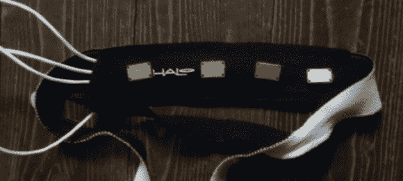

# 现成的脑电图硬件记录你的梦

> 原文：<https://hackaday.com/2013/06/01/off-the-shelf-eeg-hardware-records-your-dreams/>

在过去的几年里，我们已经看到了[迈克尔]在电子学和清醒梦方面的冒险。借助商用脑电图硬件，[迈克尔]能够在梦中用莫尔斯电码进行交流，并记录他醒来时有节奏的眨眼以供数据分析。他的项目被称为 Lucid Scribe，现在它对几乎所有人开放——[包括使用 OpenEEG 硬件的大脑实验者](http://lsdbase.org/2013/05/24/Open-Electroencephalography/)。

OpenEEG 是一个项目，旨在通过提供硬件、电极、软件和文档来构建您自己的 EEG 耳机，从而降低 EEG 硬件的成本。这是生物反馈领域的一个伟大工具，但是[迈克尔]更进一步；他正忙于编写一种算法，这种算法将检测快速眼动睡眠，并在他处于做梦状态时播放音频轨道，以触发清醒梦。

[Michael]指出，任何拥有 OpenEEG 硬件(包括 DIY Olmex 板)的人都可以为他的 Lucid Scribe 数据库做出贡献。你可能还会有一些清醒做梦的时间，但之后你将不得不面对现实生活的残酷现实。