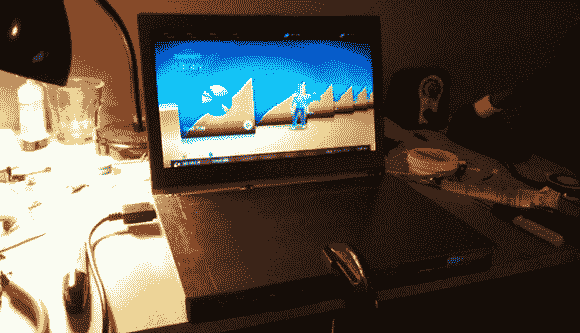

# 迄今为止最薄的 Xbox 笔记本电脑

> 原文：<https://hackaday.com/2013/06/03/the-thinnest-xbox-laptop-yet/>

随着每一代游戏机的出现，总有一天新机器的价格足够便宜，二手机器足够多，以至于游戏机黑客在下一代到来之前使出浑身解数。对于 Xbox 360 来说，现在是时候了，由于没有类似 PS1 的硬件版本，看起来[jhax01]的定制 Xbox 360 笔记本电脑可能是我们将在很长一段时间内看到的最小的 Xbox casemod。

[jhax01]从[Yung Jeezus]和[allyourboxneeds]YouTube 频道的作品中受到启发，决定为 Xbox 360 slim 制作自己的定制外壳。该案件是由铝板切割与一个简单的角磨机和弯曲廉价的 18 英寸港口货运制动器。尽管有这些极其简单的工具，[jhax01]还是设法制造了一个与 Xbox 笔记本电脑工艺大师们不相上下的外壳。

光驱和第二块硬盘的计划一起被抛弃了。显示器的外壳和铰链来自华硕的 Zenbook，因此这个项目以 ZenBox 命名。显示器的面板被丢弃，换上了一个可以与找到的 LVDS 转换器[jhax]一起工作的面板，使笔记本电脑的分辨率达到了 1366×768。

这是一件令人惊叹的工艺，而且是一台令人印象深刻的薄游戏机。附赠电池，我们将非常乐意随身携带。