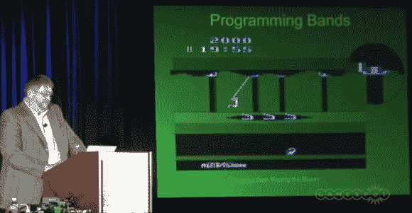

# Retrotechtacular:我如何为 Atari 2600 编写 Pitfall

> 原文：<https://hackaday.com/2013/06/05/retrotechtacular-how-i-wrote-pitfall-for-the-atari-2600/>

本周，我们又一次偏离了 Retrotechtacular 部分中常见的 campy 视频。这一次视频只有两年的历史，但主题是从 20 世纪 80 年代初。[大卫·克拉尼]，雅达利 2600 的陷阱设计师在 2011 年游戏开发者大会上发表了讲话。他 38 分钟的陈述加起来整整一个小时，之后是问答环节&。开始有点枯燥，但他在中途开始了他的大步，充满了关于过去事情的多汁食物。

[David]为 Activision 编写游戏，Activision 是一家在游戏设计师离开雅达利后成立的公司，他们被告知他们不比组装实际墨盒的装配线工人更重要。我们想知道，一旦 Pitfall 连续 64 周成为全球销量第一的游戏，雅达利是否还会有人头落地？

这是一个开发人员的面板，所以你可以打赌下面的视频深入挖掘编码挑战。帧缓冲器？不会吧！2600 一次只能输出 160 个像素；一条电视扫描线。这些程序与电视刷新率的同步令人绝望，甚至被限制在一条扫描线内可以画多少东西。对我们来说，最有趣的部分是在接近结尾的时候，当[David]描述游戏屏幕只不过是一个带有精心选择的种子的伪随机数生成器。但话说回来，手动优化代码以适应 4k ROM 上的 6k 游戏的回忆也同样令人信服。

如果你喜欢这个，你应该看看[修复 Atari 游戏](http://hackaday.com/2013/04/06/fixing-the-worst-video-game-ever-e-t-for-atari-2600/)中编码故障的努力。

[https://www.youtube.com/embed/MBT1OK6VAIU?version=3&rel=1&showsearch=0&showinfo=1&iv_load_policy=1&fs=1&hl=en-US&autohide=2&wmode=transparent](https://www.youtube.com/embed/MBT1OK6VAIU?version=3&rel=1&showsearch=0&showinfo=1&iv_load_policy=1&fs=1&hl=en-US&autohide=2&wmode=transparent)

[via [Reddit](http://www.reddit.com/r/programming/comments/1ffe2m/pitfall_classic_postmortem_with_programmer_david/)