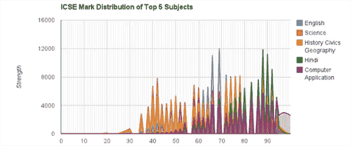

# 黑进高中考试，用统计数据挫败他们

> 原文：<https://hackaday.com/2013/06/05/hacking-high-school-exams-and-foiling-them-with-statistics/>

几周前，[Debarghya Das]有两个朋友急切地等待着他们高中毕业考试的结果，这是 ISC 国家考试，参加考试的有 65，000 名 12 年级学生。这次考试对每个学生的未来都至关重要；几分决定了哪所大学录取你，哪所拒绝你。[Debraghya]的一个朋友对他的成绩有点担心，问是否有可能在公布成绩之前黑进教育委员会的服务器看看成绩。[【Debraghya】就这么做了](http://deedy.quora.com/Hacking-into-the-Indian-Education-System)，并且能够下载几乎每个参加考试的学生的考试记录..通过更仔细地观察数据，他还发现了这些分数以某种方式被改变的证据。

从 CISCE 教育委员会的服务器上获取分数非常简单；每个学校都有一个单独的代码，每个学生都有一个单独的号码。通过最简单的 javascript 魔术，[Debraghya]发现可以通过在 CISCE 服务器上指向/[4 位数学校 ID]/[3 位数学生 ID]的脚本来访问个人成绩。这里完全没有安全措施，这的确是一个令人印象深刻的疏忽。

在编写了一个小脚本并在几台机器上运行后，[Debraghya]有了 65，000 名学生的考试成绩、姓名和身份证号。仔细查看数据，他绘制了所有分数，得出了一个看起来非常奇怪的图表(见上图)。它看起来像一只刺猬，而几乎所有如此大规模的测试都应该是一条连续的曲线。

[Debraghya]确信他发现了篡改成绩的证据。近三分之一的可能得分没有出现在数据中，但从 94 到 100 的得分都被考虑在内，这使得刺猬形状的图表在统计学上是不可能的。当然[Debraghya]只有原始分数，并不确切知道考试是如何评分的，也不知道考试是如何被操纵的。不过，他确实知道分数被修改了，要么是通过将原始分数正常化，要么是一些更奇怪、更邪恶的东西。

尽管从一台未加密的服务器上抓取数据算不上什么黑客行为，但不管新闻会告诉你什么，我们对[Debraghya]的数据分析以及他揭发并公开这些数据的能力印象深刻。没有任何关于这些分数是如何改变的信息，这实际上不会改变什么，我们欢迎评论中的任何猜测。