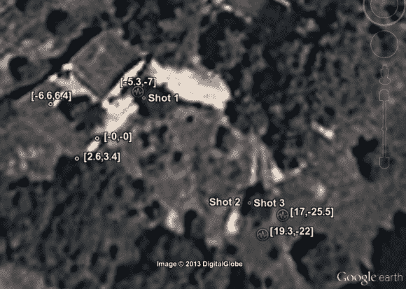

# 回声定位精确定位了枪响的来源

> 原文：<https://hackaday.com/2013/06/09/echolocation-pinpoints-where-a-gunshot-came-from/>

怀疑猎人离他的房子太近了。当想到量化这种信念的方法时，他着手建立一个基于枪声的三角测量系统。其背后的理论是[声学定位](http://en.wikipedia.org/wiki/Acoustic_location)，这是一种专门类型的回声定位。

回声定位最常见的例子是在蝙蝠身上，它们发出超声波噪音，并通过倾听回声来判断物体的位置。[Kripthor]不需要自己产生声音，他只需要在不同的点拾取它。三个样本的时间差可用于三角测量坐标，如上图所示。

他首先尝试使用 PC 声卡来收集样本。立体声输入只提供两个通道，所以他用一个基于 555 的多路复用电路来从三个通道中采样。产生的电路噪音太大了，所以他改用 Arduino。ADC 通过一个用作简单放大器的 NPN 晶体管对每个麦克风进行采样。

这让我想起了很久以前自制的声纳黑客。