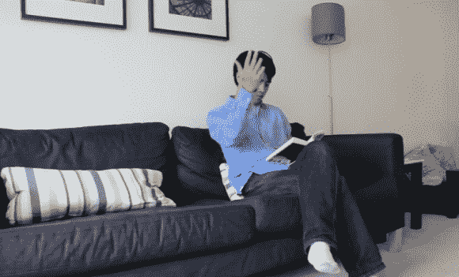

# 手势控制使用 WiFi 多普勒频移

> 原文：<https://hackaday.com/2013/06/10/gesture-control-uses-wifi-doppler-shift/>

我们以前说过:在未来，简单的界面将只使用你的身体。至少乍一看，这款基于 WiFi 的手势控制系统就是这种情况。如果你家里有互联网，你可能有一个无线接入点。这是等式的第一部分。剩下的是一种测量无线电波如何从你的身体反弹的方法。到目前为止，这是通过软件定义无线电(SDR)实现的，但华盛顿大学的研究人员认为，这种技术有可能内置于未来的 WiFi 设备中。

演示视频显示，这名男子挥动手臂调节家庭娱乐系统的音量。直觉告诉我们，如果你的手臂不是当时唯一在运动的东西，这是不可能的。但是这个问题很快就解决了。多个天线可以同时跟踪多个人。还需要考虑假阳性。该系统需要一个适度复杂的唤醒手势序列，以防止你在床上翻身时意外打开立体声。

如果你在这方面有困难，考虑一下这个超声波音乐播放器。WiFi 版本做同样的事情，但处理返回无线电波的变化要复杂得多。

[https://www.youtube.com/embed/VZ7Nz942yAY?version=3&rel=1&showsearch=0&showinfo=1&iv_load_policy=1&fs=1&hl=en-US&autohide=2&wmode=transparent](https://www.youtube.com/embed/VZ7Nz942yAY?version=3&rel=1&showsearch=0&showinfo=1&iv_load_policy=1&fs=1&hl=en-US&autohide=2&wmode=transparent)

【感谢 Mateusz 通过[今日 UW](http://www.washington.edu/news/2013/06/04/wi-fi-signals-enable-gesture-recognition-throughout-entire-home/)和 [Y 组合](https://news.ycombinator.com/item?id=5824286)