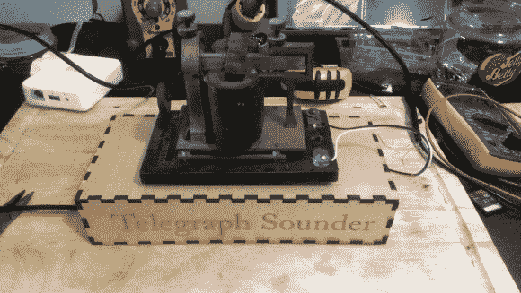

# 电报发声器发出电子邮件信息

> 原文：<https://hackaday.com/2013/06/12/telegraph-sounder-clicks-out-email-messages/>

[Patrick Schless]兴奋地展示他在大约九个月前接手的项目。在找到一个古董电报发声器后，他把它连接到一个 Arduino 上，看能否让它发出声音。这个成功的实验为不同的硬件奠定了基础，这些硬件将成为莫尔斯电码电子邮件阅读器。

他不太了解老硬件的背景，但是开起来相对简单。它基本上是一个磁性继电器，所以你需要一个晶体管来开关和一个反激二极管来保护。一旦这些组件就位，只需稍微拨动一下即可。[Patrick]知道他想从网上获取信息，所以他把 Arduino 放在一边，拿起一个树莓派。它非常有效。他的计划是把它永久地放在书架上，所以他做了额外的努力，设计了自己的 PCB，并使用 OSH Park service 进行旋转。这个项目以这个容纳所有电子设备的低轮廓激光切割底座而结束。

现在，如果他想用莫尔斯电码回复电子邮件，他需要制作这个键盘。

[https://www.youtube.com/embed/qvFkdSAh710?version=3&rel=1&showsearch=0&showinfo=1&iv_load_policy=1&fs=1&hl=en-US&autohide=2&wmode=transparent](https://www.youtube.com/embed/qvFkdSAh710?version=3&rel=1&showsearch=0&showinfo=1&iv_load_policy=1&fs=1&hl=en-US&autohide=2&wmode=transparent)