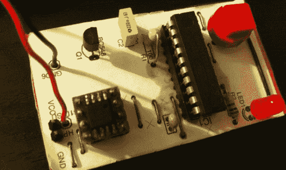

# 给玩具一个电子声音

> 原文：<https://hackaday.com/2013/06/11/giving-toys-an-electronic-voice/>

无论是 Furby 还是巴斯光年的按钮播放“无限远”，玩具中的大多数数字音频应用实际上都很简单。没有 Arduino 和 wave shield，当然也没有来自互联网的 Raspi 流媒体音频。不，大多数玩具内部的音频是一个或两个芯片设备，能够存储大约一分钟左右的音频。[makapuf]为他的孩子们制作了一个电子棋盘游戏，并在这个过程中决定[添加一些数字音频](http://s3-eu-west-1.amazonaws.com/makapufprojects/oie/doc.html#goose)。结果与实际工程产品中的结果非常相似，而且简单到几乎任何人都可以复制。

[makapuf]的游戏是基于[鹅的游戏](http://en.wikipedia.org/wiki/Game_of_the_Goose)，只是用电子说话骰子带入了现代世界。微控制器选择了 ATtiny2313，而 [AT45D](http://octopart.com/partsearch#search/requestData&q=At45DB041&rangedfilters%5Bmemory_size%5D%5Bmin%5D=4000000&rangedfilters%5Bmemory_size%5D%5Bmax%5D=4000000) 4 兆位闪存模块提供了 8 位/8khz 音频的存储。

游戏的电子部分有一些功能。第一种是大声说出数字，这是通过播放[马卡普夫]朗读的录音来完成的，“一”，“二”，“三”，“十二”，“三”，“青少年”等等。这些数据通过一个小的放大器从 ATtiny 上的一个引脚输出到一个扬声器。之后，代码就是一个简单的事情，记录玩家在棋盘上的位置，记录分数，并生成随机数。

这是工程学上的一个特殊练习，用最少的零件制作一个相当复杂的游戏。[makapuf]估计他在零件上花了不到 4 美元，所以如果你正在寻找一个便宜的项目添加数字音频，我们无法想象会做得更好。

休息之后你可以看到一段[马卡普夫]项目的视频。

[//player.vimeo.com/video/68089370](//player.vimeo.com/video/68089370)