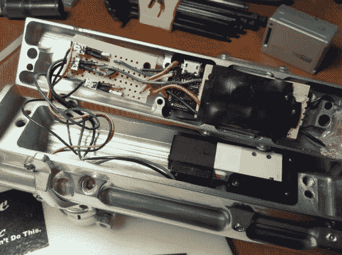

# 彩弹枪的定制驱动板

> 原文：<https://hackaday.com/2013/06/15/custom-driver-board-for-paintball-gun/>

[Gabe]多年来一直想做一些嵌入式开发，最近他的另一个爱好玩彩弹给他提供了一个测试项目。他一直在为他的彩弹枪定制驱动板。不要被这个名字迷惑，GCode 是他的名字和他为项目编写代码的事实的混搭。它与 [G 代码数控语言](https://en.wikipedia.org/wiki/G-code)无关。

起初，这似乎是一个微不足道的黑客，但这个维京彩弹枪有一些严重的速度和吞吐量，所以他需要一个可靠的控制，不会只是随机开始射击。[Gabe]考虑的另一件事是监控装载过程，以确保彩弹在发射前完全就位。所有这些都是由那个小小的 Femtoduino 板处理的。它使用安装在它上面的连接器板与枪硬件接口。

构建日志中有几个视频。但我们发现官方认可的每秒 12.5 球模式和快得离谱的自动射击剪辑最有趣。它应该在躲避[彩弹猎枪](http://hackaday.com/2011/06/11/the-breech-loaded-paintall-shotgun/)挥舞的对手时派上用场。

[https://www.youtube.com/embed/2mQIRrWI1_Q?version=3&rel=1&showsearch=0&showinfo=1&iv_load_policy=1&fs=1&hl=en-US&autohide=2&wmode=transparent](https://www.youtube.com/embed/2mQIRrWI1_Q?version=3&rel=1&showsearch=0&showinfo=1&iv_load_policy=1&fs=1&hl=en-US&autohide=2&wmode=transparent)

[https://www.youtube.com/embed/pHe4vB7FRk0?version=3&rel=1&showsearch=0&showinfo=1&iv_load_policy=1&fs=1&hl=en-US&autohide=2&wmode=transparent](https://www.youtube.com/embed/pHe4vB7FRk0?version=3&rel=1&showsearch=0&showinfo=1&iv_load_policy=1&fs=1&hl=en-US&autohide=2&wmode=transparent)