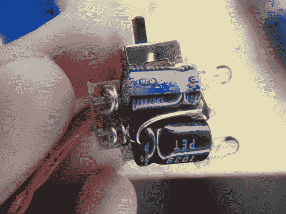

# 给一个曲柄手电筒一个超级电容器检修

> 原文：<https://hackaday.com/2013/06/21/giving-a-crank-flashlight-a-super-capacitor-overhaul/>

[Caleb]得到了一个微型 LED 手电筒，有一个曲柄用来充电。不幸的是，它没有保持电荷，不断启动也不是很好。他打开盒子，发现了一个锂电池。他没有使用插入式替代物[，而是焊接了自己的超级电容器](http://cpprojects.blogspot.com/2013/06/adding-capacity.html)。

库存装置非常简单。它使用标准的 DC 发动机作为发电机。它使用一组齿轮连接到曲柄，上面看到的两根红线将它连接到控制板。四个二极管组成一个电桥，经过整流后直接馈入电池。难怪那个细胞会坏掉！

但是这个方向对于使用电容来说并不坏。它们可以直接充电，将发光二极管连接到电压的开关不会干扰它们的工作。最后一个问题是在箱子里为它们腾出空间。[Caleb]考虑了一些不同的方法，但最终只是加热塑料外壳，直到它可以变形，为额外的部件腾出空间。