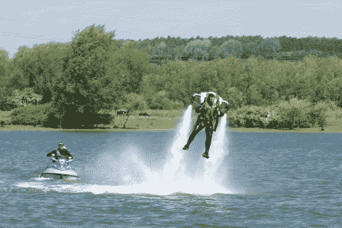

# Wetlev 2 喷水包的致命性略低于以前的版本

> 原文：<https://hackaday.com/2013/06/22/wetlev-2-water-jetpack-marginally-less-lethal-than-prior-version/>

你不得不承认，坐在你自己的水上喷气背包上绕湖一周的想法是一个诱人的提议。这是[托比·加德纳]第二次尝试解决他的体型问题。去年他离开了水面，但是喷气背包很难控制。经过一个冬天，他重新设计了喷水器的喷嘴，它们似乎做得更好了。

事实上，建筑会经常接触水，这使得它有点困难。他们需要有不会腐蚀但能承受压力的零件。不锈钢是显而易见的选择，对于改进，他们能够从相当多的现成零件开始。他做了一个成型背包的模具，拿出来兜了一圈。我们从远处看不到新版本。但是看下面的视频，你会看到去年它试图淹死他，今年它似乎漂浮起来。

为什么他在建造而不是购买？你见过[原版](http://hackaday.com/2009/01/29/water-powered-jet-pack/)的价格吗？

版本 2

[https://www.youtube.com/embed/76KmdhbBwrk?version=3&rel=1&showsearch=0&showinfo=1&iv_load_policy=1&fs=1&hl=en-US&autohide=2&wmode=transparent](https://www.youtube.com/embed/76KmdhbBwrk?version=3&rel=1&showsearch=0&showinfo=1&iv_load_policy=1&fs=1&hl=en-US&autohide=2&wmode=transparent)

版本 1

[https://www.youtube.com/embed/FzA-w_TjjZA?version=3&rel=1&showsearch=0&showinfo=1&iv_load_policy=1&fs=1&hl=en-US&autohide=2&wmode=transparent](https://www.youtube.com/embed/FzA-w_TjjZA?version=3&rel=1&showsearch=0&showinfo=1&iv_load_policy=1&fs=1&hl=en-US&autohide=2&wmode=transparent)