# 红牛创作 2013:最后的想法和总结

> 原文：<https://hackaday.com/2013/06/18/redbull-creation-2013-final-thoughts-and-recap/>

[https://www.youtube.com/embed/yrZoBuvLlaw?version=3&rel=1&showsearch=0&showinfo=1&iv_load_policy=1&fs=1&hl=en-US&autohide=2&wmode=transparent](https://www.youtube.com/embed/yrZoBuvLlaw?version=3&rel=1&showsearch=0&showinfo=1&iv_load_policy=1&fs=1&hl=en-US&autohide=2&wmode=transparent)

我已经安全到家了，我就不跟你讲我的飞行经历有多可怕的冗长而无聊的故事了，双向的。这场比赛令人愉快。我不仅观看了球队的比赛，还见到了我很久以来一直想见的人。与法官和商店监督员交谈和共事是一件愉快的事。创作网站上有一些[很棒的每日回顾视频](http://creation.redbullusa.com/)，但是我不能嵌入它们。

你可能想知道谁赢了。嗯，那是我离开后宣布的。公众甚至还没有开始对人们的选择进行投票(我们甚至还没有完成制作带有投票按钮的标志！).

评委们来自不同的专业领域。我们为每个有几个不同值的项目填写了一个表格。有功能性、美观性、足智多谋，还有其他一些我现在记不起来了的东西。[格雷格]把标准放在一起，我认为他在使评判公平和平衡方面做了出色的工作。

[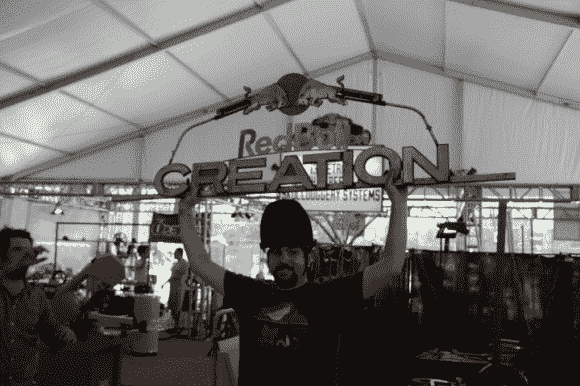](http://hackaday.com/wp-content/uploads/2013/06/img_7574-small.jpg)

**评委选择** : MB 实验室

他们做了一个很酷的讲台，有一个非常直观的大理石风格的音序器。这个音序器驱动一些鼓，这些鼓是由从汽车门锁上扯下来的致动器演奏的。真的很酷。

 [")](https://hackaday.com/2013/06/18/redbull-creation-2013-final-thoughts-and-recap/img_7592-small/)  [")](https://hackaday.com/2013/06/18/redbull-creation-2013-final-thoughts-and-recap/img_7591-small/)  [")](https://hackaday.com/2013/06/18/redbull-creation-2013-final-thoughts-and-recap/img_7590-small/)  [")](https://hackaday.com/2013/06/18/redbull-creation-2013-final-thoughts-and-recap/img_7589-small/)  [")](https://hackaday.com/2013/06/18/redbull-creation-2013-final-thoughts-and-recap/img_7568-small/) 

**人民选择:** 1.21 吉加瓦茨

这是来自群众的投票。他们可以走上前去，按下他们选择的按钮。

仪器的工作原理如下:

1.你可以把颜料喷在白纸上(在一卷纸上)。

2.这台机器会把纸拉过来，用光学方法阅读。

3.机器会根据纸上颜料的颜色和位置发出声音。

 [")](https://hackaday.com/2013/06/18/redbull-creation-2013-final-thoughts-and-recap/img_7582-small/) the instrument [")](https://hackaday.com/2013/06/18/redbull-creation-2013-final-thoughts-and-recap/img_7581-small/) behind the scenes [")](https://hackaday.com/2013/06/18/redbull-creation-2013-final-thoughts-and-recap/img_7580-small/) spaghetti [")](https://hackaday.com/2013/06/18/redbull-creation-2013-final-thoughts-and-recap/img_7572-small/)  [")](https://hackaday.com/2013/06/18/redbull-creation-2013-final-thoughts-and-recap/img_7571-small/) 

**球队选择:** I3 底特律

这是来自其他队伍的投票。这项投票考虑了诸如“这个团队有多大帮助”和“他们是否愉快”等因素。

他们的仪器只是转动那些发出噪音的管子。这对于评委的展示来说效果不太好，但是他们做了一点调整，得到了一些更好的音效。虽然和他们在一起很开心，而且他们的想法很有创意(没有 midi！).

 [")](https://hackaday.com/2013/06/18/redbull-creation-2013-final-thoughts-and-recap/img_7603-small/)  [")](https://hackaday.com/2013/06/18/redbull-creation-2013-final-thoughts-and-recap/img_7602-small/)  [")](https://hackaday.com/2013/06/18/redbull-creation-2013-final-thoughts-and-recap/img_7564-small/) 

我已经分享了 Pissbot，[你可以在这里看到的行动](https://vine.co/v/hB1engEvqaq)，和投票标志，一旦红牛推出更多的图像，你会看到更多。

活动期间还有另一个附带项目在进行。一些定制皮带扣将被授予某人，但我不记得是谁了。也许是为了团队选择。这是其中一个完成时的照片。

[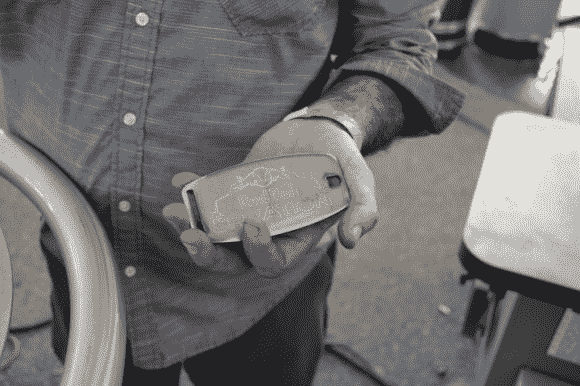](http://hackaday.com/wp-content/uploads/2013/06/img_7561-small.jpg)

这是一组过去一天的随机图片。享受吧。

 [")](https://hackaday.com/2013/06/18/redbull-creation-2013-final-thoughts-and-recap/img_7601-small/)  [")](https://hackaday.com/2013/06/18/redbull-creation-2013-final-thoughts-and-recap/img_7600-small/)  [")](https://hackaday.com/2013/06/18/redbull-creation-2013-final-thoughts-and-recap/img_7598-small/)  [")](https://hackaday.com/2013/06/18/redbull-creation-2013-final-thoughts-and-recap/img_7593-small/)  [")](https://hackaday.com/2013/06/18/redbull-creation-2013-final-thoughts-and-recap/img_7594-small/)  [")](https://hackaday.com/2013/06/18/redbull-creation-2013-final-thoughts-and-recap/img_7596-small/)  [")](https://hackaday.com/2013/06/18/redbull-creation-2013-final-thoughts-and-recap/img_7597-small/)  [")](https://hackaday.com/2013/06/18/redbull-creation-2013-final-thoughts-and-recap/img_7588-small/)  [")](https://hackaday.com/2013/06/18/redbull-creation-2013-final-thoughts-and-recap/img_7587-small/)  [")](https://hackaday.com/2013/06/18/redbull-creation-2013-final-thoughts-and-recap/img_7586-small/)  [")](https://hackaday.com/2013/06/18/redbull-creation-2013-final-thoughts-and-recap/img_7583-small/)  [")](https://hackaday.com/2013/06/18/redbull-creation-2013-final-thoughts-and-recap/img_7584-small/)  [")](https://hackaday.com/2013/06/18/redbull-creation-2013-final-thoughts-and-recap/img_7585-small/)  [")](https://hackaday.com/2013/06/18/redbull-creation-2013-final-thoughts-and-recap/img_7575-small/)  [")](https://hackaday.com/2013/06/18/redbull-creation-2013-final-thoughts-and-recap/img_7573-small/)  [")](https://hackaday.com/2013/06/18/redbull-creation-2013-final-thoughts-and-recap/img_7570-small/)  [")](https://hackaday.com/2013/06/18/redbull-creation-2013-final-thoughts-and-recap/img_7566-small/)  [")](https://hackaday.com/2013/06/18/redbull-creation-2013-final-thoughts-and-recap/img_7565-small/)  [")](https://hackaday.com/2013/06/18/redbull-creation-2013-final-thoughts-and-recap/img_7567-small/)  [")](https://hackaday.com/2013/06/18/redbull-creation-2013-final-thoughts-and-recap/img_7569-small/)  [")](https://hackaday.com/2013/06/18/redbull-creation-2013-final-thoughts-and-recap/img_7563-small/)  [")](https://hackaday.com/2013/06/18/redbull-creation-2013-final-thoughts-and-recap/img_7562-small/)  [")](https://hackaday.com/2013/06/18/redbull-creation-2013-final-thoughts-and-recap/img_7560-small/)  [")](https://hackaday.com/2013/06/18/redbull-creation-2013-final-thoughts-and-recap/img_7559-small-2/)  [")](https://hackaday.com/2013/06/18/redbull-creation-2013-final-thoughts-and-recap/img_7558-small-2/) 

以下是该活动的一些官方图片！

 [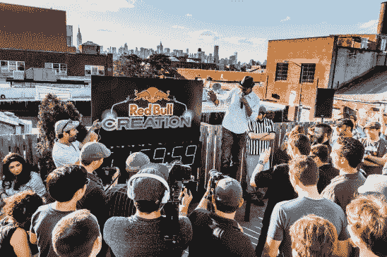](https://hackaday.com/2013/06/18/redbull-creation-2013-final-thoughts-and-recap/participants-lifestyle/)  [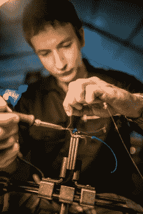](https://hackaday.com/2013/06/18/redbull-creation-2013-final-thoughts-and-recap/participant-lifestyle/)  [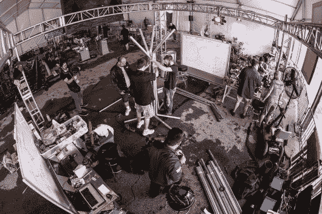](https://hackaday.com/2013/06/18/redbull-creation-2013-final-thoughts-and-recap/participants-lifestyle-2/)  [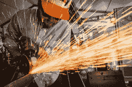](https://hackaday.com/2013/06/18/redbull-creation-2013-final-thoughts-and-recap/participant-lifestyle-2/)  [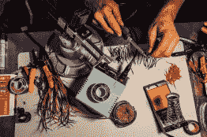](https://hackaday.com/2013/06/18/redbull-creation-2013-final-thoughts-and-recap/participant-lifestyle-3/)    [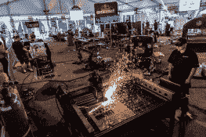](https://hackaday.com/2013/06/18/redbull-creation-2013-final-thoughts-and-recap/participants-lifestyle-3/)  [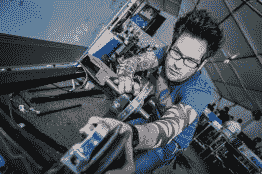](https://hackaday.com/2013/06/18/redbull-creation-2013-final-thoughts-and-recap/participant-lifestyle-4/)  [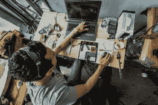](https://hackaday.com/2013/06/18/redbull-creation-2013-final-thoughts-and-recap/participant-lifestyle-5/)  [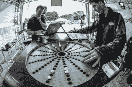](https://hackaday.com/2013/06/18/redbull-creation-2013-final-thoughts-and-recap/participants-lifestyle-4/)    [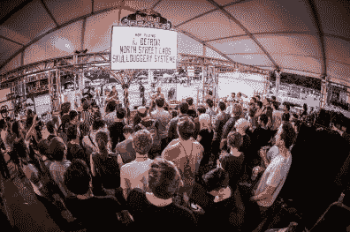](https://hackaday.com/2013/06/18/redbull-creation-2013-final-thoughts-and-recap/venue/)  [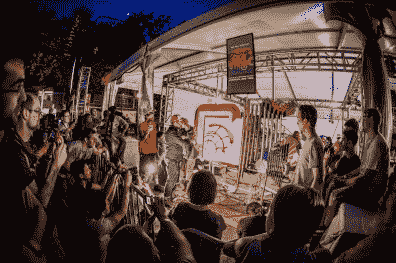](https://hackaday.com/2013/06/18/redbull-creation-2013-final-thoughts-and-recap/participants-lifestyle-6/)  [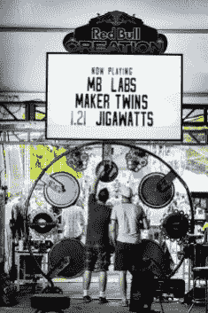](https://hackaday.com/2013/06/18/redbull-creation-2013-final-thoughts-and-recap/participants-lifestyle-7/)  [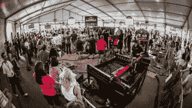](https://hackaday.com/2013/06/18/redbull-creation-2013-final-thoughts-and-recap/venue-2/)  [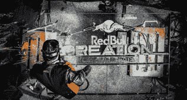](https://hackaday.com/2013/06/18/redbull-creation-2013-final-thoughts-and-recap/participant-lifestyle-6/)  [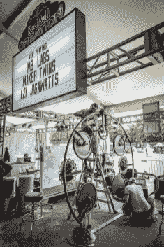](https://hackaday.com/2013/06/18/redbull-creation-2013-final-thoughts-and-recap/participants-lifestyle-8/)  [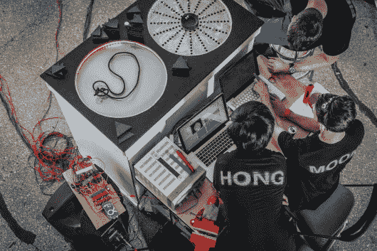](https://hackaday.com/2013/06/18/redbull-creation-2013-final-thoughts-and-recap/participants-lifestyle-9/)  [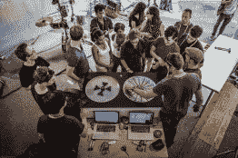](https://hackaday.com/2013/06/18/redbull-creation-2013-final-thoughts-and-recap/spectators/)  [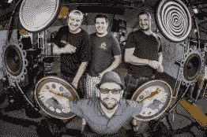](https://hackaday.com/2013/06/18/redbull-creation-2013-final-thoughts-and-recap/maker-twins-portrait/)  [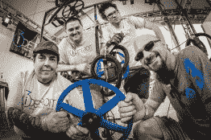](https://hackaday.com/2013/06/18/redbull-creation-2013-final-thoughts-and-recap/i3-detroit-portrait/)  [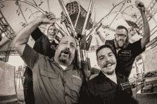](https://hackaday.com/2013/06/18/redbull-creation-2013-final-thoughts-and-recap/north-street-portrait/)  [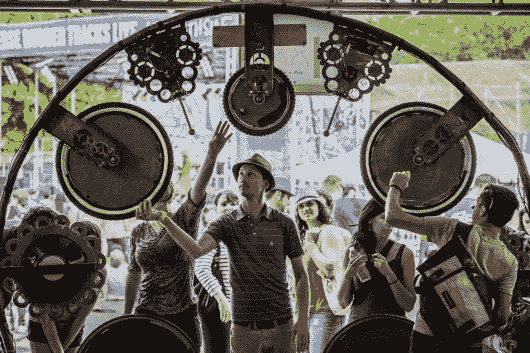](https://hackaday.com/2013/06/18/redbull-creation-2013-final-thoughts-and-recap/spectators-2/)  [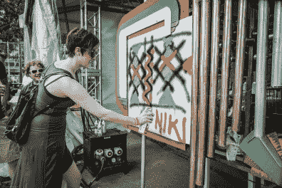](https://hackaday.com/2013/06/18/redbull-creation-2013-final-thoughts-and-recap/spectators-3/)  [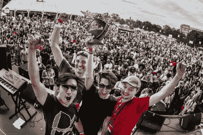](https://hackaday.com/2013/06/18/redbull-creation-2013-final-thoughts-and-recap/mb-labs-winner/)