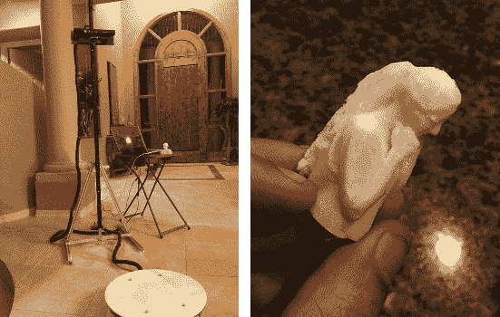

# Kinect 全身扫描仪

> 原文：<https://hackaday.com/2013/06/23/kinect-full-body-scanner/>

为什么让运输安全管理局享受全身扫描的乐趣？你不仅可以得到自己的数字模型，还可以按比例打印出来。

[Moheeb Zara]仍在开发基于 Kinect 的全身扫描仪。但是他花了一点时间展示了第一个工作原型。进入构建的部件要么在带锯上切割，要么激光切割，要么 3D 打印。该设备的扫描部分使用一个独立的垂直轨道，允许 Kinect 沿着 Z 轴移动。雪橇通过重力保持在适当的位置，并使用绞盘沿轨道向上移动，绞盘顶部的滑轮上缠绕着一些钢缆。

实验对象站在[Moheeb]设计和组装的旋转平台上。在平台下面，你会发现一个激光切割的环，环内有齿。安装在 3D 打印支架上的电机使用这些齿来旋转平台。为了使平台自动化，他还有一些工作要做。在这个演示中，他使用手动开关移动扫描过程中的每一步。使用[重建模块](http://reconstructme.net/)将采集的数据组装成虚拟模块。

Kinect 以前曾被用作类似的 3D 扫描仪。但那一次是扫描畅销商品，而不是人。

[https://www.youtube.com/embed/pQg2txJlbQw?version=3&rel=1&showsearch=0&showinfo=1&iv_load_policy=1&fs=1&hl=en-US&autohide=2&wmode=transparent](https://www.youtube.com/embed/pQg2txJlbQw?version=3&rel=1&showsearch=0&showinfo=1&iv_load_policy=1&fs=1&hl=en-US&autohide=2&wmode=transparent)