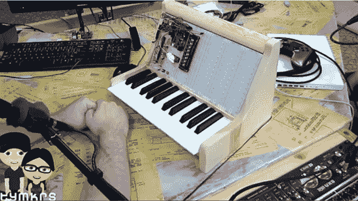

# 在试验板上构建合成器

> 原文：<https://hackaday.com/2013/06/21/building-a-synth-on-a-breadboard/>

构建模拟合成器是一项挑战，但有了[Tymkrs] protosynth，这比以往任何时候都容易。这是一个 25 键键盘，连接到一堆无焊试验板上，使模拟合成器原型制作变得轻而易举。

早些时候，[Tymkrs]获得了一大堆无焊试验板，并决定通过制作一个组件级模块化合成器来投入使用。早期版本将键盘上的每个键连接到试验板后面的几根电线上，并连接到一个移位寄存器上，这样就可以用加载了 Commodore SID 仿真器的 Propeller dev 板来读取它们。新版本保持了非常干净的背面键盘连接器，但这次[Tymkrs]增加了一些组件，增加了序列器设置和旋转编码器。

这个非常酷的实验板合成器的最终目标是在实验板上轻松探索 Moogs、Arps 和其他模拟合成器的世界。[Tymkrs]已经组装了一个兼容[试验板的低通和高通滤波器](https://www.tindie.com/stores/tymkrs/)。虽然要让模拟合成器成为现实还有很多工作要做，但[tym kr]已经有了一个很好的开始。

[https://www.youtube.com/embed/jlt8fjSZiJw?version=3&rel=1&showsearch=0&showinfo=1&iv_load_policy=1&fs=1&hl=en-US&autohide=2&wmode=transparent](https://www.youtube.com/embed/jlt8fjSZiJw?version=3&rel=1&showsearch=0&showinfo=1&iv_load_policy=1&fs=1&hl=en-US&autohide=2&wmode=transparent)