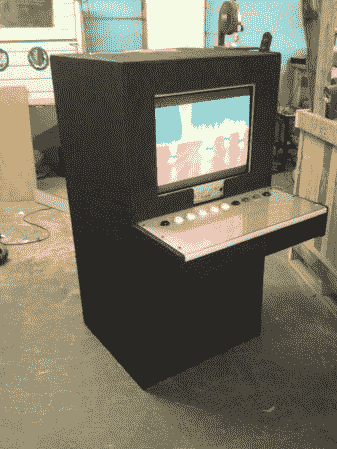

# [里奇的]坚固耐用的 DVD 播放器

> 原文：<https://hackaday.com/2013/06/22/rickys-rugged-dvd-player/>

绝对喜欢看 DVD。他患有癫痫，认知功能水平大约相当于 6 岁儿童。他的弟弟[Ronnie]注意到[Ricky 的 DVD 和他的 DVD 播放器由于一些粗暴的处理从来没有持续很长时间。[罗尼]通过建造这个超级坚固的 DVD 观看站来让[里奇]的生活稍微轻松一点。

他开始撕掉 DVD 播放器的前 pcb，上面有所有的按钮。[Ricky]可以很快穿过一组标准按钮，所以[Ronnie]将这些扩展到街机按钮。然后，他把所有东西都装进了一个定制的柜子里，这个柜子可以承受相当多的虐待。

现在他们可以装入 5 张磁盘，里奇可以随心所欲地观看，而不用担心损坏播放器。

[Ronnie]提到他想使用某种微控制器制作一个更复杂的控制系统，但坦率地说，我认为这种简单是完美的。也许装载电影的媒体电脑可能是一个不错的下一步。你可以在这里看到[【罗尼的】建造日志](http://thestuffimade.blogspot.com/2013/05/rickys-dvd-player-part-2.html)。

如果您曾经考虑过做这样的事情来改善某人的生活，您应该去 thecontrollerproject.com看看，那里有特殊需求的人可以和能够建立接口的人联系。