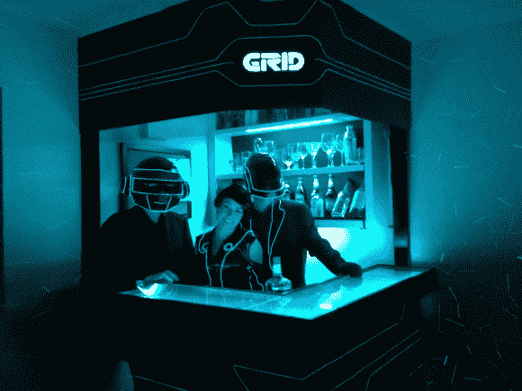

# 如何建造一个蠢朋克常去的创酒吧

> 原文：<https://hackaday.com/2013/06/24/how-to-build-a-tron-bar-that-daft-punk-would-hang-out-at/>

当然，这张图片中的酒吧看起来很整洁。但是展示其与音乐同步的视频将它带到了一个新的层次。闪光灯和电线上演了一出好戏，可能会让调酒师觉得他们已经喝多了。

项目最有趣的部分是，这一切都是从安装在墙上的半个书架开始的。[亚历山大·吉文斯]和他的室友决定通过在它周围建一个酒吧来增加它作为酒柜的实用性。但是为什么就此打住呢？LED 灯条和 120 英尺长的电致发光管使酒吧内部发光。照亮的线条很明显，但 LED 灯条的位置可能不明显。他们中的几个照亮了摆放酒和玻璃杯的架子。巴托普本身是由玻璃制成的，填充了 75 磅的弹珠，并由其余的长条从下面点燃。

一个带 EL 保护罩的 Arduino Mega 驱动系统。这些家伙建立了一个基本的控制界面，看起来部分泄漏容忍。它就在酒吧内缘的下面。

他们的服装也很出彩。但是有了像这样的内置核心，他们可能想升级到更精确的复制品。

[https://player.vimeo.com/video/68986159](https://player.vimeo.com/video/68986159)