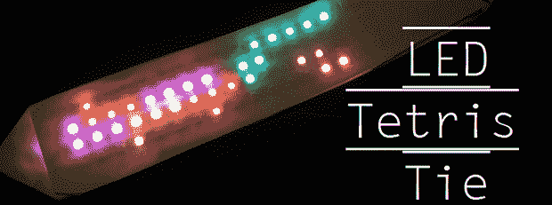

# LED Tie 玩俄罗斯方块

> 原文：<https://hackaday.com/2013/06/25/led-tie-plays-tetris/>

[Bill]今年夏天在 STEM 夏令营与一群八年级学生一起工作，用他的极客服装给他们留下深刻印象，例如 8 位和 PCB 领带，以及 LED 照明实验室外套。青春期的修补匠们问他最后一天会穿什么。不想让孩子们失望，他在一个晚上匆匆做了一条 [LED 俄罗斯方块领带](http://www.billporter.info/2013/06/21/led-tetris-tie/)。

俄罗斯方块板是一个基于 WS2811 的 RGB LED 灯条的 20 x 4 网格，由 Digispark dev 板控制。从结构上看，领带只是两块卡片，中间夹着电子元件。贴在廉价的夹子上。在下面的视频中，tie 没有任何输入来控制方块的移动和旋转。[Bill]计划用一些基本的人工智能更新他的领带，这样它就可以自己玩了。

所有代码都在[【比尔】的 git](https://github.com/madsci1016/LEDTetrisTie) 上结束。这仍然是一项正在进行的工作，但从 STEM 学生的反应来看，这种联系有很大的潜力。

[https://www.youtube.com/embed/JNLJZY2Oivs?version=3&rel=1&showsearch=0&showinfo=1&iv_load_policy=1&fs=1&hl=en-US&autohide=2&wmode=transparent](https://www.youtube.com/embed/JNLJZY2Oivs?version=3&rel=1&showsearch=0&showinfo=1&iv_load_policy=1&fs=1&hl=en-US&autohide=2&wmode=transparent)