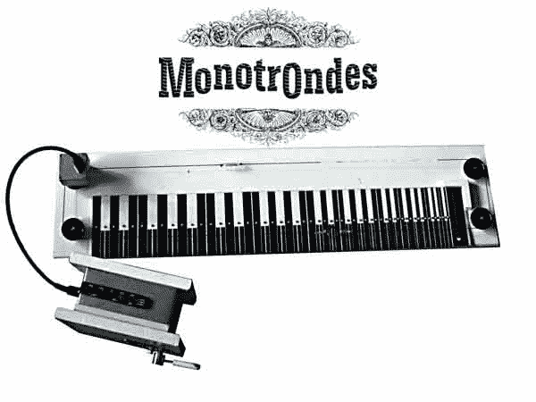

# Ondes Martenot 比特雷门琴好

> 原文：<https://hackaday.com/2013/06/25/the-ondes-martenot-better-than-a-theremin/>

[Ville]喜欢 ondes martenot 的声音，并决定建造自己的。不，它不像 20 世纪 20 年代的原件那样由真空管制成，这一个是由一个便宜的现成的模拟合成器和一些额外的部件制成的。

ondes martenot 是一种类似特雷门琴的乐器；ondes 不是在特雷门琴上的天线周围挥动双手，而是使用一个连接在演奏者手指上的小环，这个小环通过一个线圈和一个音量控制杆。无论如何，翁德斯不是一种普通的乐器，但是电台司令在任何情况下都使用一个 T2 几个 T3。

[Ville]从一个小型、廉价、新的 [Korg Monotron](http://www.korg.com/monotrons) 模拟带状合成器开始建造，打开它，阅读原理图。一个 100k 的多圈罐被连接到 monotron 上，并用一个滑轮系统和一个小金属圈固定在一个印刷的纸键盘上。随着多圈罐连接到 monotron 上的音高输入端，[Ville]有了一个半精确且非常实用的 ondes martenot 复制品。

休息之后你可以听到[维尔]的精彩表演。开始时有点粗糙，但当他循环播放多个短语时，听起来真的很棒。

[https://www.youtube.com/embed/YpDvUq1EvDY?version=3&rel=1&showsearch=0&showinfo=1&iv_load_policy=1&fs=1&hl=en-US&autohide=2&wmode=transparent](https://www.youtube.com/embed/YpDvUq1EvDY?version=3&rel=1&showsearch=0&showinfo=1&iv_load_policy=1&fs=1&hl=en-US&autohide=2&wmode=transparent)