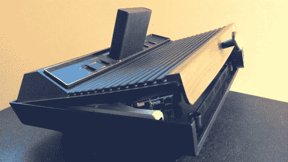

# 雅达利 2600 的引擎盖下藏着一个树莓派

> 原文：<https://hackaday.com/2013/06/26/atari-2600-has-a-raspberry-pi-hiding-under-the-hood/>

说真的，这个雅达利 2600 上的抽屉拉不到货。他们不知道这样会使保修失效吗？事实是，你无论如何也找不到任何原始的内部结构。当建造这个装在 2600 盒中的[便携式模拟器时，【Linear Nova】小心翼翼地确保一切都可以在某个时候恢复到原始状态(除了背面安装的两个铰链)。这是一个为自己设定的好目标。我们认为构建是大多数项目的有趣部分，并且经常想知道当他们完成时该做什么，我们的兴趣已经减弱了。](http://www.raspberrypi.org/phpBB3/viewtopic.php?f=78&t=47957)

使用 Velcro 将一个 7 英寸的 LCD 屏幕连接到盖子的底部。当它向上倾斜时，对玩家来说是一个很好的视角。[Linear]更喜欢用 Wii 遥控器来控制这个便携式视频游戏模拟器。它使用 USB 加密狗通过蓝牙连接到 Raspberry Pi。这样做的好处是，你也可以把遥控器放在盒子里。目前有两条电源线，一条用于 RPi，另一条用于 LCD 屏幕，但他计划在未来增加一个电源集线器，以缩小到一条。我们想知道这也是一个很好的时间来添加他自己的充电电池组选项？应该有足够的空间放一个 RC 风格的包。