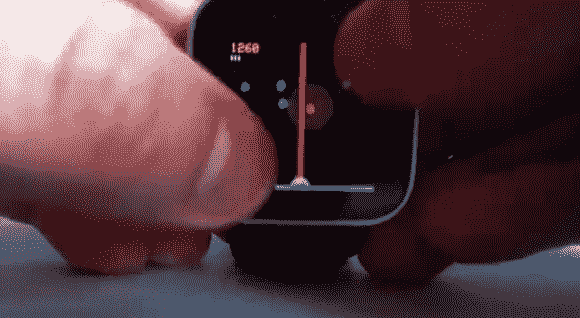

# 作为索尼智能手表固件的 Astrosmash 风格视频游戏

> 原文：<https://hackaday.com/2013/06/27/astrosmash-style-video-game-as-sony-smartwatch-firmware/>

这里有一个固件黑客[给索尼智能手表](http://www.labz.bz/?p=11)带来了一个视频游戏。考虑到有限的屏幕空间和它必须与触摸输入共享的事实，这是非常令人印象深刻的。但是我们发现同样令人印象深刻的是，在索尼宣布[能够为手表制作自己的固件](http://hackaday.com/2013/06/14/hackit-sony-invites-you-to-hack-its-smartwatch-firmware/)之后，这么快就有了这种质量的游戏。快速的发展部分归功于社区驱动的努力[黑掉 Arduino IDE 以在手表上加载草图](https://github.com/underverk/SmartWatch)。

这个 IDE 黑客的出现意味着将你的 Arduino 草图书写能力带到这个硬件上只需要相当低的学习曲线。通读(阿西尔·阿伦茨的)游戏代码会使它变得更加容易。他称他的游戏为《星球大战》,但这让我们想起了《星际粉碎》。有一个绿色的小半圆是你的地面防御车辆。你需要发射激光从布满星星的夜空中发射下落的物品，同时收集落到地面的能量。游戏视频在下面。

请记住，如果你为智能手表开发了一个很酷的固件应用程序[，我们希望听到它的消息](http://hackaday.com/contact-hack-a-day/)。

[https://www.youtube.com/embed/LreGFKy9Cjw?version=3&rel=1&showsearch=0&showinfo=1&iv_load_policy=1&fs=1&hl=en-US&autohide=2&wmode=transparent](https://www.youtube.com/embed/LreGFKy9Cjw?version=3&rel=1&showsearch=0&showinfo=1&iv_load_policy=1&fs=1&hl=en-US&autohide=2&wmode=transparent)