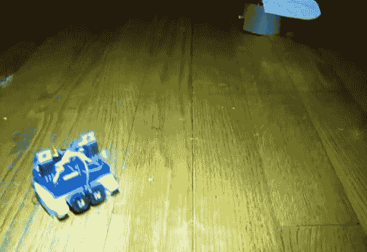

# 建造一盏跟随刚毛机器人的灯，作为教授科学的一种方式

> 原文：<https://hackaday.com/2013/06/29/build-a-light-following-bristlebot-as-a-way-to-teach-science/>

[Ben Finio]设计这个项目是为了让孩子们对学习科学和工程感兴趣。我们只想造一个自己的有错吗？这是一个光跟随刚毛机器人，它本身很容易制造和理解。我们认为该平台有很大的潜力来引领其他事情，如了解微控制器和无线模块，以实现无线控制。

现在它基本上是两个刚毛机器人组合成一个包。上面看到的屏幕截图让人很难分辨出电池组两侧的两个牙刷头。该建筑的底盘是一个蓝色的迷你试验板。让它跟着光走的电路就是简单的定义。[Ben]使用两个 MOSFETs 来控制安装在底盘后角的两个振动电机。每个 MOSFET 的栅极由包括光敏电阻的分压器驱动。当一个传感器上的光线比另一个更亮时，它会使机器人转向更亮的传感器。当查看上面的项目日志时，请确保点击标签以查看所有可用的信息。

这个方向控制好像挺好的。我们还见过其他版本的机器人通过改变机器人的重量来改变方向。

[https://www.youtube.com/embed/SoHNVHZ2fng?version=3&rel=1&showsearch=0&showinfo=1&iv_load_policy=1&fs=1&hl=en-US&autohide=2&wmode=transparent](https://www.youtube.com/embed/SoHNVHZ2fng?version=3&rel=1&showsearch=0&showinfo=1&iv_load_policy=1&fs=1&hl=en-US&autohide=2&wmode=transparent)