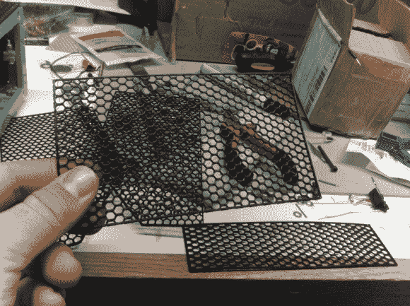

# 轻松 3D 打印网格屏幕

> 原文：<https://hackaday.com/2013/06/29/easily-3d-print-mesh-screens/>

如果你需要一种方法来让你的项目围栏的开口看起来更漂亮，那就直接用 3D 打印机吧。上图中[Alfred]正在展示[他打印网格格栅的 Slic3r 技术的成果](http://quelab.net/wordpress/8888/8888/)。

需要注意的是，您需要确保您使用的是 Slic3r 版本 0.9.8。这在新版本中不起作用，因为从 0.9.9 开始，软件会在你的设计底部增加一个筏子。

烤架可以是你想要的任何形状。它从建立轮廓模型开始，然后将边向下挤压与你想要的网格厚度相同的距离。将设计文件导入 Slic3r 后，[Alfred]使用支持材料设置选择此蜂窝设计。然后，他将填充密度设置为零。这意味着设计将不会被打印，只有填充材料，导致这些蜂窝屏幕。

Slic3r 是一款非常棒的软件。请看对 Slic3r 首席开发人员的采访。