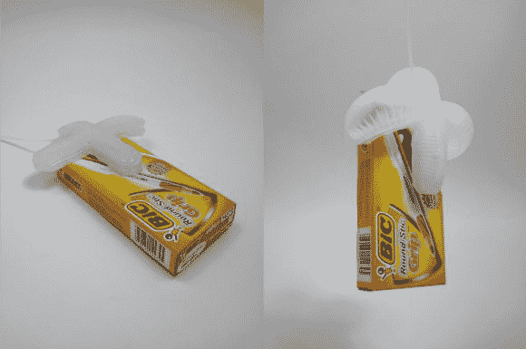

# 气动夹具设计使其易于生产

> 原文：<https://hackaday.com/2013/06/30/air-powered-gripper-design-makes-them-easy-to-produce/>

这种无脊椎动物的抓手利用气压抓住物体。秘密都在设计中。但是你不必重新发明轮子。如果你有一台 3D 打印机，你可以[按照这个指南制作自己的](http://www.instructables.com/id/Air-Powered-Soft-Robotic-Gripper/)。

夹子由硅树脂制成。诀窍在于设计一种内部结构，当受到压力时，它会向一个方向变形。要做一个或一百个，只需下载[设计文件](http://www.thingiverse.com/thing:78973)，3D 打印一个模具。那里的过程很像[我们在三月份看到的硅胶带原型制作过程](http://hackaday.com/2013/03/12/molding-rubber-for-a-pre-production-prototype-use-a-3d-printed-model/)。将两部分硅酮混合并倒入模具中。你还需要倒一些在平面上。我们的印象是未固化的硅酮不会粘在固化的硅酮上，但我们错了。用一批新的混合物将两部分粘合在一起。一切准备就绪后，你可以用软管刺穿膀胱以注入空气。

下面可以看到正在测试的星形版本。还有一个哈佛大学的研究视频，展示了一个类似的举起鸡蛋的设计。

[https://www.youtube.com/embed/g210oczAqGo?version=3&rel=1&showsearch=0&showinfo=1&iv_load_policy=1&fs=1&hl=en-US&autohide=2&wmode=transparent](https://www.youtube.com/embed/g210oczAqGo?version=3&rel=1&showsearch=0&showinfo=1&iv_load_policy=1&fs=1&hl=en-US&autohide=2&wmode=transparent)

[https://www.youtube.com/embed/csFR52Z3T0I?version=3&rel=1&showsearch=0&showinfo=1&iv_load_policy=1&fs=1&hl=en-US&autohide=2&wmode=transparent](https://www.youtube.com/embed/csFR52Z3T0I?version=3&rel=1&showsearch=0&showinfo=1&iv_load_policy=1&fs=1&hl=en-US&autohide=2&wmode=transparent)