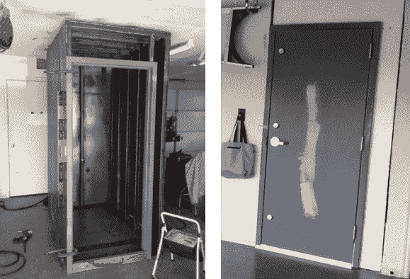

# 建造你自己的钢筋风暴避难所

> 原文：<https://hackaday.com/2013/07/01/build-your-own-steel-reinforced-storm-shelter/>

在过去的几年里，许多危险的风暴席卷了美国中部。我们惊讶地听说，该国那个地区的许多居民在面临迫在眉睫的危险时没有地下室可以避难。但是一个足智多谋的黑客总是能够找到改善自己处境的方法。这个例子特别有用。这是一个通向车库的钢制风暴避难所。

一切从一个方管做的笼子开始。随着骨架完全组装好，它被钢板包裹着，增加了几乎贯穿每个笼子肋骨全长的焊接接头。左边的图像显示了钢门框夹紧到位。在避难所滑到位并用螺栓固定在混凝土板上后，看看右边的完工版本。

Reddit 上的讨论包括一场关于门应该向内还是向外打开的辩论。向外摆动意味着如果开口被碎片堵塞，你可能会被困。但是可能有科学研究证明这是一个更好的方向。无论哪种方式，我们希望三个死螺栓，门锁和重型铰链将经得起压力，如果这是曾经使用过的。