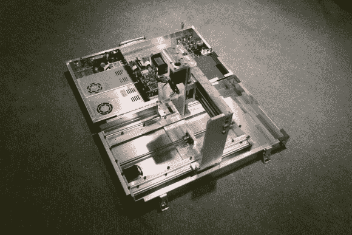

# 公文包工厂

> 原文：<https://hackaday.com/2013/07/01/briefcase-mill/>

带着机修店；这是驱使[Ryan]在公文包中建造[这个数控工厂的咒语。这张专辑会让你尝到最终产品的味道。但是你会想从这篇文章](http://imgur.com/a/n0Lcu)开始，深入阅读他的论坛帖子[的两页，以便观察构建过程。](http://www.cnczone.com/forums/benchtop_machines/157385-ryans_g0704-16.html#post1228914)

上面的图像只是制作的一部分，但我们认为它给出了他的作品的最佳整体视图。它缺少连接到盖子控制电路的电缆。床也没有安装，这是在他为多氯联苯制造保护壳之前。

把所有的东西都装进一个折叠盒里是一个很大的技巧。当然，他使用 CAD 来确保这是可能的。有几个地方关闭时的间隙约为 2mm。我们对工厂本身的建造质量感到震惊。让它便于携带是一个新颖的想法，但是机器的准确性和可靠性并没有因为这个概念而受到影响。

如果你需要一台不太便携的台式磨，这里有一个项目会给你一些灵感。