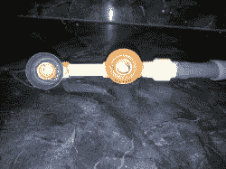

# 黑客日链接:2013 年 6 月 30 日周日

> 原文：<https://hackaday.com/2013/06/30/hackaday-links-sunday-june-30th-2013/>

为了更好地驱动 WS2811 LED 协议，从 8MHz AVR 芯片中挤出周期的竞赛正在进行。

[Asher]如果可以自己制作，他不想买木炭水族箱过滤器。他在几个塑料饮料瓶里装满了木炭，在瓶壁上开了几个槽，然后把它们连接到他的泵系统上。休息过后，他的作品展就可以展出了。

制造微型电池的最好方法是 3d 打印吗？哈佛的研究人员是这样认为的。[谢谢乔纳森和伊泰]

Ouya 游戏机现已面向大众发售。[Hunter Davis]报道说[retro de 与 Ouya 开箱即用](http://www.hunterdavis.com/2013/06/08/video-retrode-ouya-n64-controller-and-cartridge-right-out-of-the-box-fun/)一起工作。如果你不记得听说过它， [Retrode 读取你原来的盒式只读存储器](http://hackaday.com/2010/03/22/snega2usb-changes-name-learns-new-tricks/)用于模拟器。

用 300 块 Raspberry Pi 板制作一台集群计算机听起来像是一场噩梦。组织是这个项目的关键。

哈佛校友杰里米·库克正在研究一个电子雪茄盒。在这里，他展示了它监听语音指令的能力。

开尔文夹是一种鳄鱼夹，两个钳口相互绝缘。[Kaushlesh]想出了一种将它们变成镊子探针的方法。

