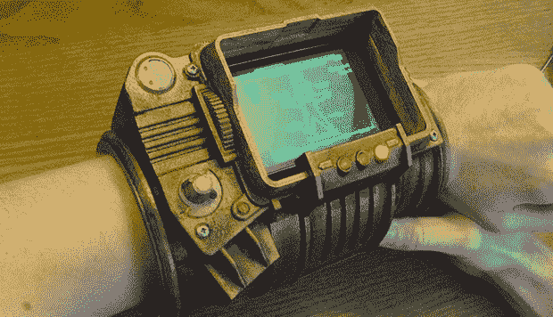

# 3D 打印 Pip-Boy，不含盖革计数器

> 原文：<https://hackaday.com/2013/07/01/3d-printed-pip-boy-geiger-counter-not-included/>

是的，我们都喜欢传送门枪和撬棍，但有一件视频游戏随身用品可能会成为现代技术专家的一件有用的硬件。这是 Pip-Boy 3000，来自*辐射*和[的可戴在手腕上的电脑，现在你可以在你的 3D 打印机上打印了。](http://www.instructables.com/id/A-3D-printable-Pip-Boy-3000/)

这个 Pip-Boy 的所有作品都可以在 Thingiverse 上[买到。这些文件中包括十几个塑料部件，当它们组装在一起时，就形成了一台可戴在手腕上的电脑。当然，你可以打印出这个建筑的 Pip-Boy 屏幕的静态图像，但[dragonator]对他的模型做了一点补充——他放了一个智能手机的空间，所以你所有的环境传感器和库存管理也可以与这个 3D 打印模型一起工作。](http://www.thingiverse.com/thing:109716)

这远不是我们见过的第一个可穿戴的 Pip-Boy，但它是第一个能够在 3D 打印机上制造的，并且有一个很好的好处，就是它是有史以来最好的手机壳。把这些放在一起仍然有很多工作要做，但是我们会说结果非常棒。

你可以看看下面 Pip-Boy 的演示视频。

[https://www.youtube.com/embed/-DZEGLmWa2A?version=3&rel=1&showsearch=0&showinfo=1&iv_load_policy=1&fs=1&hl=en-US&autohide=2&wmode=transparent](https://www.youtube.com/embed/-DZEGLmWa2A?version=3&rel=1&showsearch=0&showinfo=1&iv_load_policy=1&fs=1&hl=en-US&autohide=2&wmode=transparent)