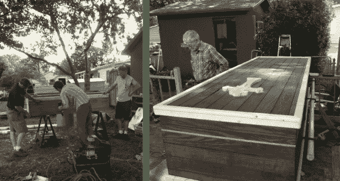

# 一家人合力打造爸爸的棺材

> 原文：<https://hackaday.com/2013/07/02/family-pulls-together-to-build-dads-casket/>

在现代，我们很少听到家庭建造自己的棺材。但是这个记录死者的兄弟和儿子制作顶级棺材的项目日志真的很感人。你可能会想，它们不可能包含你在商业生产的模型上发现的所有功能。然而，我们记得看过《T2》中关于棺材的一集，里面除了木工和简单的室内装潢之外没有太多东西。

建筑始于胶合板箱，内衬薄木条以增加强度。然后，该小组用细木条将它包裹起来(也许是地板？)经过一层污渍后看起来棒极了。我们不确定两边栏杆的金属支架来自哪里。如果你认识他们，我们很乐意在评论中听到。

这里的底线是，对于习惯于用双手工作的家庭来说，这是一个巨大的敬意，也是在最近的损失后相互交流的一种方式。

[via [Reddit](http://www.reddit.com/r/pics/comments/1ha7yp/my_dad_died_this_month_my_brother_my_uncle_and/)