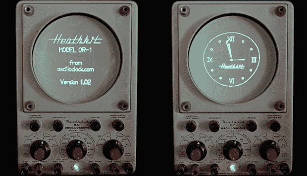

# 把爷爷的望远镜变成了时钟

> 原文：<https://hackaday.com/2013/07/01/turning-grandpas-o-scope-into-a-clock/>

大约在 1960 年，[Aaron]的祖父决定尝试电子维修这一新的职业。虽然没有成功，但在他放弃之前，他制作了一台漂亮的希斯基特示波器，型号为 OR-1。爷爷的电子事业从未起飞，但多年后，它将成为[亚伦]自己的电子事业的推动力。现在[亚伦]有太多的示波器，但仍然想找到一种方法来保存他祖父的遗产。一个示波时钟就是这样一个项目。

当然，将示波器变成时钟需要一些有趣的控制电路，而[Aaron]并没有吝啬他的构建。他创造了一个定制的控制板,可以在阴极射线管屏幕上用圆圈画出任何形状；挤压圆以画一条线，并完全切割光束以将圆切成两半。

这绝不是[亚伦]的第一个示波时钟。他之前完全从零开始创造了这个神奇的时钟。尽管如此，使用爷爷的旧工具是让这个示波器再次有用的一个好方法，即使[Aaron]已经忙于测试设备。