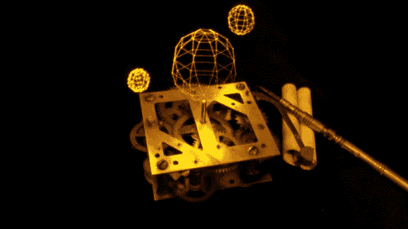

# 三角洲机器人的超精确光画

> 原文：<https://hackaday.com/2013/07/03/super-precise-light-painting-from-a-delta-robot/>

这些几何形状的点完美地排列在一起，这要归功于控制光源的 delta 机械臂。光源是一个简单的 LED，可以随着它的移动而开关。在黑暗的房间里安装一台摄像机，在手臂移动时保持快门打开。我们假设该图像中静止物体的所有光线也来自 LED。

[恶心难过]建造三角洲机器人就是为了这个目的。看看下面的视频，也许更重要的是听听运动中的事物。说真的，步进电机的呜呜声在这一个上相当可怕。

delta 概念在三个从上方向下倾斜的臂上使用一个中心头部。如果 LED 也指向下方，它将不会照亮硬件，这就是它不会显示在图像中的原因。当[使用这种类型的机器进行 3D 打印](http://hackaday.com/2012/07/13/3d-printing-with-a-delta-robot-that-seems-to-simplify-the-concept/)时，我们已经看到了类似的精度。但是如果你不想建造一个复杂的机器，你可以[用一个简单的弦绘图仪](http://hackaday.com/2012/02/27/light-painting-with-a-string-plotter/)试试这个。

[https://www.youtube.com/embed/grOqSynXMQU?version=3&rel=1&showsearch=0&showinfo=1&iv_load_policy=1&fs=1&hl=en-US&autohide=2&wmode=transparent](https://www.youtube.com/embed/grOqSynXMQU?version=3&rel=1&showsearch=0&showinfo=1&iv_load_policy=1&fs=1&hl=en-US&autohide=2&wmode=transparent)