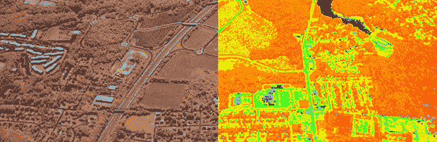

# 用红外线观察植物健康

> 原文：<https://hackaday.com/2013/07/03/seeing-plant-health-in-infrared/>

自 70 年代以来，美国国家航空航天局、美国国家海洋与大气管理局和美国地质调查局一直在运行一系列旨在观察世界各地植被健康状况的卫星。这些名为 Landsat 的卫星使用专门的相机滤镜来观察叶绿素反射的光，以测量森林、平原、海洋甚至农场的健康状况。这都是非常有趣的技术，有几个非常酷的人[想把这些近红外相机中的一个](http://publiclab.org/wiki/near-infrared-camera)放在每个人的手中。

从轨道上测量植物健康状况的基本想法，或者说[归一化差异植被指数](http://publiclab.org/wiki/ndvi-plots-ir-kit)，实际上非常简单:吸收红色和蓝色的光(因此我们有翠绿的森林)，反射几乎所有的红外光。通过从数码相机中移除红外滤光片并添加“超级蓝”滤光片，只需一点点图像处理就可以计算出 NDVI。

这背后的人已经[建立了一个 Kickstarter](http://www.kickstarter.com/projects/publiclab/infragram-the-infrared-photography-project) ,奖励包括一个经过修改的网络摄像头，一个定制的傻瓜相机，以及一个非常低成本的超级蓝色滤镜。只是看看你的花园如何生长，或者你如何有效地杀死室内植物。