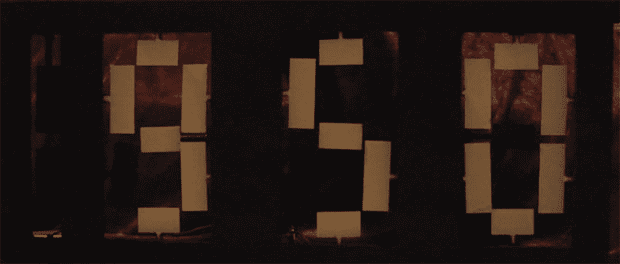

# 22 个伺服系统和一个很棒的时钟

> 原文：<https://hackaday.com/2013/07/03/twenty-two-servos-and-an-awesome-clock/>

我们永远无法获得足够多有趣的时钟构建，而[【ebrithil】的伺服时钟](http://ebrithil.de/servo-clock/)(德意志，[谷歌翻译](http://translate.google.com/translate?sl=de&tl=en&js=n&prev=_t&hl=en&ie=UTF-8&u=http%3A%2F%2Febrithil.de%2Fservo-clock%2F&act=url))是其中最好的。这个时钟有 22 个伺服系统，以只有 Arduino 项目才能实现的机械精度向前移动时间。

[ebrithil]的时钟中的数字被构造成七段显示器，只是伺服系统不是点亮 led，而是转动一面亮一面暗的小纸片。将伺服系统旋转 180 度，可以将每一段从一种阴影变为另一种阴影，从而形成一个机电七段显示器。

伺服系统由连接到 DS1302 实时时钟的 Arduino Mega 控制。这个项目的一个问题是，每当有人打开连接到同一电路的灯时，线段会稍微旋转。他解决了这个问题，通过运行一个永久充电的手机电池电路，让他可以随时随地不耽误时间。

[https://www.youtube.com/embed/IYjI_1zLZVc?version=3&rel=1&showsearch=0&showinfo=1&iv_load_policy=1&fs=1&hl=en-US&autohide=2&wmode=transparent](https://www.youtube.com/embed/IYjI_1zLZVc?version=3&rel=1&showsearch=0&showinfo=1&iv_load_policy=1&fs=1&hl=en-US&autohide=2&wmode=transparent) [https://www.youtube.com/embed/95xyD30JG8I?version=3&rel=1&showsearch=0&showinfo=1&iv_load_policy=1&fs=1&hl=en-US&autohide=2&wmode=transparent](https://www.youtube.com/embed/95xyD30JG8I?version=3&rel=1&showsearch=0&showinfo=1&iv_load_policy=1&fs=1&hl=en-US&autohide=2&wmode=transparent)