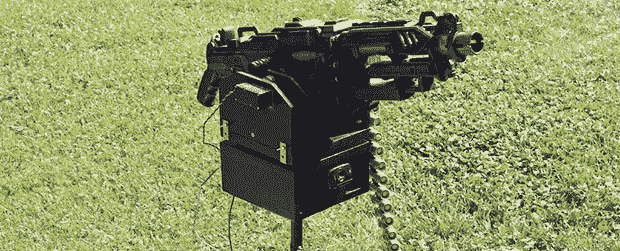

# 改装一把 nerf 枪

> 原文：<https://hackaday.com/2013/07/03/sentrifying-a-nerf-gun/>

[Brittliv]犯了一个错误，让她的朋友进入了 Nerf 武器，于是开始了通过泡沫飞镖相互确保毁灭的竞赛。她可能在这场战争中占据上风，因为她的 [Nerf Vulcan 哨兵枪](http://www.instructables.com/id/Nerf-Vulcan-Sentry-Gun/?ALLSTEPS)不仅威力惊人，而且能够通过带有敌我识别系统的网络摄像头自主操作。

火炮的方位角和仰角支架由胶合板制成，每个轴由一个连接到 Arduino 的单一伺服系统控制。当然，一个普通的 Nerf 枪会相当无聊，所以[BrittLiv]通过用一个 5 公斤的弹簧代替一个 2 公斤的弹簧，增加了枪马达的电压和枪的强度。

使用处理和来自[项目哨兵枪](http://projectsentrygun.rudolphlabs.com/make-your-own/using-the-software)的一点代码，通过网络摄像头跟踪目标。一个有趣的功能是一个朋友或敌人跟踪系统；如果枪支看到有人穿着带有 Instructables 标志的 t 恤，目标就会被识别为朋友，而不会被塑料飞镖残忍地杀死。

[https://www.youtube.com/embed/C70R7oo4jMc?version=3&rel=1&showsearch=0&showinfo=1&iv_load_policy=1&fs=1&hl=en-US&autohide=2&wmode=transparent](https://www.youtube.com/embed/C70R7oo4jMc?version=3&rel=1&showsearch=0&showinfo=1&iv_load_policy=1&fs=1&hl=en-US&autohide=2&wmode=transparent)