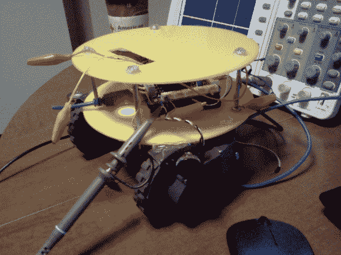

# 从坏掉的 Roomba 机器人上回收零件

> 原文：<https://hackaday.com/2013/07/08/salvaging-parts-from-broken-roomba-robots/>

在 Roombas 上进行黑客攻击的伟大之处在于，iRobot 使用优质零件来构建它们。[Jason]得到了一个损坏的 5XX 系列 Roomba，并发布了一篇关于[他如何重复使用回收部件](http://www.transistor.io/hacked-roomba-motors-and-related-robots.html)的文章。

你在上面看到的是他的工作成果之一。这个小机器人接受红外电视遥控器的命令。但是他也用这个装置制造了一个自我平衡的机器人。Roomba 的两个电机具有 8 位分辨率的磁性旋转编码器。将这与一个调整良好的 PID 算法结合起来，你就可以开始工作了。下面的视频显示他用他的 PID 代码测试一个电机。

你不会得到太多关于捐赠机器人内脏的信息。如果这是你正在寻找的，你需要看看[迪诺的] [Roomba 4000 拆卸](http://hackaday.com/2012/08/13/roomba-4000-teardown-ready-for-your-doomba-build/)。

[https://www.youtube.com/embed/2D0yhQgylkw?version=3&rel=1&showsearch=0&showinfo=1&iv_load_policy=1&fs=1&hl=en-US&autohide=2&wmode=transparent](https://www.youtube.com/embed/2D0yhQgylkw?version=3&rel=1&showsearch=0&showinfo=1&iv_load_policy=1&fs=1&hl=en-US&autohide=2&wmode=transparent)