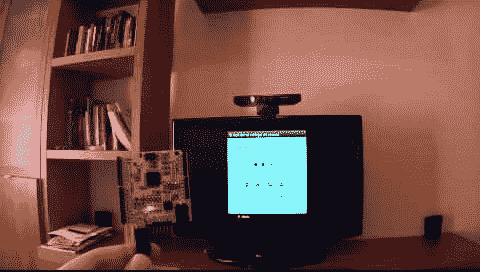

# 暴力攻击 Xbox 360 家长控制

> 原文：<https://hackaday.com/2013/07/06/brute-force-attack-xbox-360-parental-controls/>

Xbox 360 有家长控制选项。它限制了可以在系统上玩的游戏的分级。[Oscar]真的不需要解除锁定。对他来说，这只是一个有趣的概念证明。在上图中，他举着一块 Vinciduino 板。它有一个 ATmega32u4 芯片，可以[暴力破解 Xbox 360 父母代码](http://webdelcire.com/wordpress/archives/3470) ( [翻译](http://translate.google.com/translate?sl=auto&tl=en&js=n&prev=_t&hl=en&ie=UTF-8&u=http%3A%2F%2Fwebdelcire.com%2Fwordpress%2Farchives%2F3470))。

我们最近已经看到了不少这样的攻击。就像最近的 iPad pin 攻击一样，这种攻击使用微控制器来模拟键盘。正如您在视频中看到的，[Oscar]首先将菜单系统导航到解锁代码屏幕，然后插入他的设备。

解锁屏幕要求输入四位数字的 PIN。总共有 10000 种可能的组合。在演示中它看起来相当慢，但是根据他的计算，最坏的情况下，仍然会在不到 17 个小时内破解代码。显然没有锁定错误代码的最大数量。

[https://www.youtube.com/embed/l96r9QO68nw?version=3&rel=1&showsearch=0&showinfo=1&iv_load_policy=1&fs=1&hl=en-US&autohide=2&wmode=transparent](https://www.youtube.com/embed/l96r9QO68nw?version=3&rel=1&showsearch=0&showinfo=1&iv_load_policy=1&fs=1&hl=en-US&autohide=2&wmode=transparent)