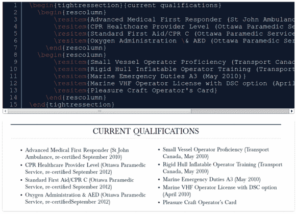

# 你的简历都用乳胶包好了

> 原文：<https://hackaday.com/2013/07/11/your-resume-all-cinched-up-in-latex/>

工程师只是做事情的方式不同，这就是为什么这个黑客对我们来说很有意义。而不是选择 Open Office 这样的平台来维护自己的简历【Campbell Hennessy】[用 LaTeX](http://campbellhennessy.com/2013/07/06/making-your-resume-beautiful-and-maintainable-with-latex/) 渲染自己的就业和推荐信。

我们一直使用 CSS 和内容管理系统(Hackaday 使用 WordPress)在 web 上将内容和样式分开。随着就业历史和工作申请的在线部分变得越来越重要，相应地准备你的简历也就很有意义了。

LaTeX 是一种标记语言，它能让排版效果变得生动有趣。我们已经看到它被用于[标记电阻存储管](http://hackaday.com/2012/03/16/hackday-links-march-16-2012/)和服务器端[将标记嵌入 HTML](http://hackaday.com/2012/02/27/finally-latex-in-html-files/) 。如果你还没有亲自尝试过，那就拿起你的简历(反正可能需要更新)，一个你选择的 LaTeX 渲染工具，打开指关节，跟着[坎贝尔]的经验走。