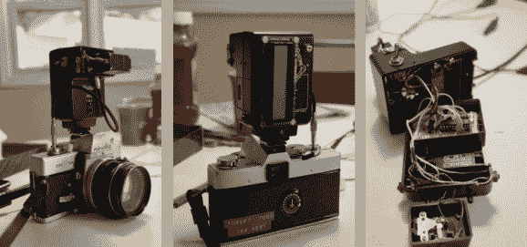

# 向电缆释放相机添加数字定时器

> 原文：<https://hackaday.com/2013/07/12/adding-a-digital-timer-to-a-cable-release-camera/>

这里有一个经典美能达单反相机的完全非侵入性的黑客。[Robby]想要增加远程快门释放的选项。他最终[制作了一个安装在热靴上的线缆释放附件](http://robwasab.blogspot.com/2013/06/part-2-wrapping-up-cable-release-project.html)。

他从我们三月份看到的一个类似的项目中获得了一些灵感。他举了那个项目的工程例子，用一个小的伺服电机来驱动电缆释放。但同时也加入了他自己的特色。

该系统以 ATtiny4313 微控制器为核心。它使用辅助闪光灯主体背面的字符 LCD 提供反馈。该闪光灯主体还提供了一个电池盒，为控制电路和伺服电机提供电源。现在它的功能就像一个倒计时器，也可以让快门保持一定的时间。但我们可以看到这种方法可以扩展到与外部传感器一起工作，当感测到运动时，在设定的光照水平下触发，或者从遥控器触发。